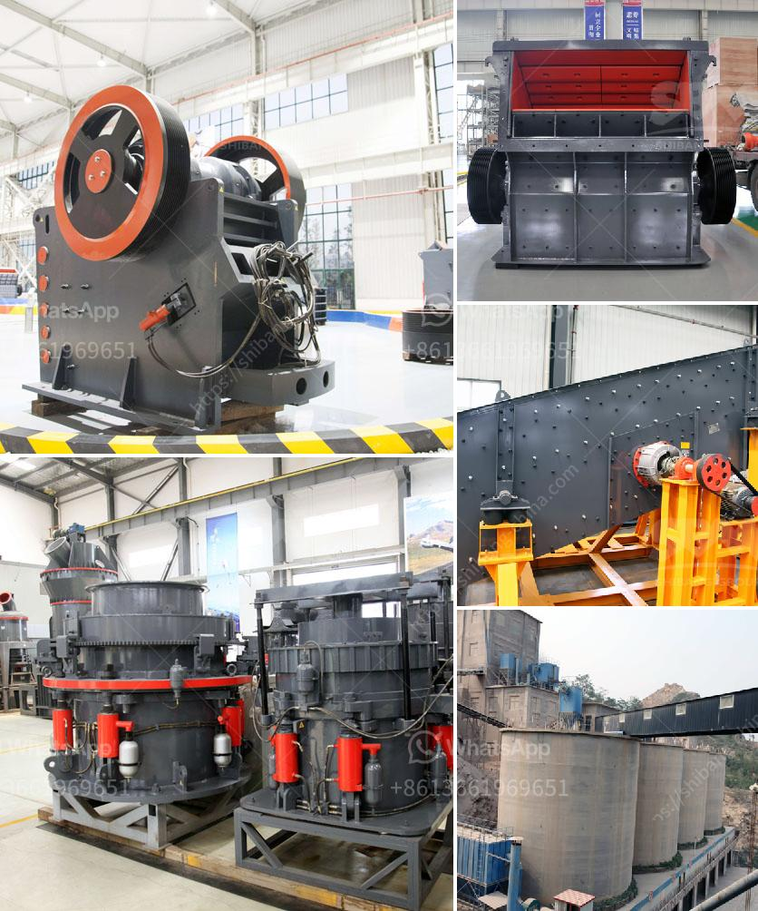

<h3>grinding mill manufacturer in gujrawala pakistan</h3>
Gujranwala, a thriving industrial city located in the province of Punjab, Pakistan, is famous for its manufacturing prowess. When it comes to grinding mills, Gujranwala is a name that stands out. Due to its geographical location and strong industrial base, the city has become a hub for various industries, including the manufacturing of grinding mills.

Grinding mills are essential equipment used in various industries, such as cement, mineral processing, and pharmaceuticals. They play a crucial role in the process of reducing the size of different materials, thus preparing them for further processing or utilization. As such, the quality and reliability of grinding mills are of utmost importance.

In Gujranwala, there are several grinding mill manufacturers who cater to the diverse needs of various industries. These manufacturers are highly experienced and have a deep understanding of the needs and requirements of their customers. They strive to deliver top-notch quality products that meet international standards.

One of the key advantages of working with a grinding mill manufacturer in Gujranwala is their expertise in customization. These manufacturers understand that every industry has different requirements, and they offer tailored solutions to meet those needs. Whether it is the size, capacity, or special features, they can modify their products accordingly.

Moreover, grinding mill manufacturers in Gujranwala focus on delivering cost-effective solutions without compromising on quality. They offer competitive prices, making their products accessible to a wide range of clients, both big and small. Additionally, they ensure prompt after-sales service, providing technical support and assistance whenever necessary.

Another significant advantage of working with local grinding mill manufacturers in Gujranwala is the ease of communication and logistics. Being located in the same city or nearby areas, it becomes convenient for customers to visit the manufacturer's facilities, inspect the products, and discuss specific requirements. Timely delivery of products is also ensured due to the proximity between the manufacturer and the customer.

In conclusion, the grinding mill manufacturers in Gujranwala, Pakistan, are reliable industry partners for various sectors. With their expertise, customization options, competitive pricing, and prompt service, they are able to cater to the diverse needs of industries such as cement, mineral processing, and pharmaceuticals. These manufacturers play a crucial role in the development and growth of industries, ensuring efficient and high-quality grinding processes.
<h3>Contact us</h3><ul><li><strong>Whatsapp:&nbsp;<a href="https://wa.me/8613661969651">+8613661969651</a></strong></li><li><a href="https://swt.shibang-china.com/?git&amp;zhl&amp;grinding mill manufacturer in gujrawala pakistan"><strong>Online Service(chat now)</strong></a></li></ul><h3>Related</h3><ul><li><a href='concrete crushing machines.md'>concrete crushing machines</a></li><li><a href='crushing stone machines for sale in usa.md'>crushing stone machines for sale in usa</a></li><li><a href='construction material recycling technology.md'>construction material recycling technology</a></li><li><a href='grinding and mixing machine for quartz.md'>grinding and mixing machine for quartz</a></li><li><a href='cement plant cost estimation.md'>cement plant cost estimation</a></li></ul>