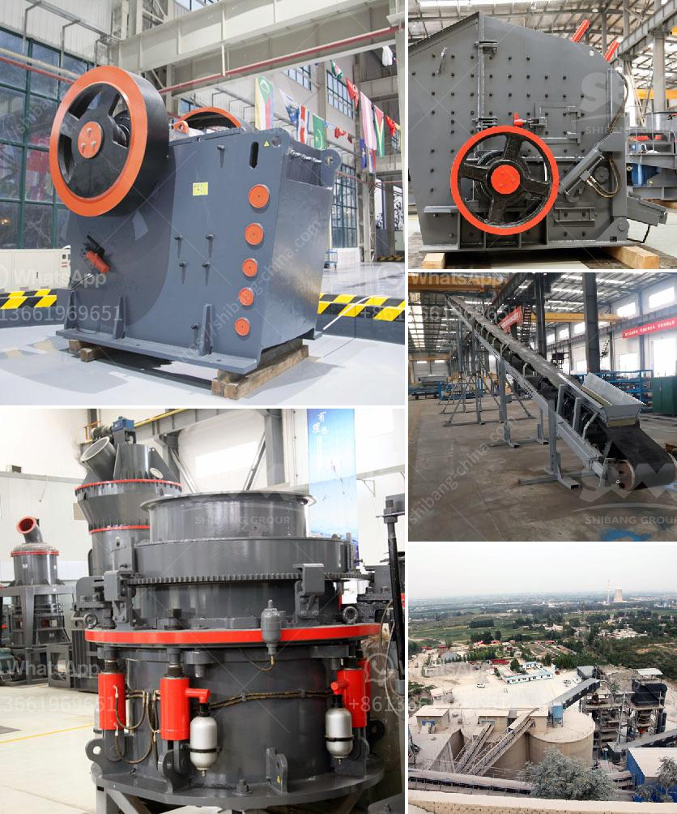

<h3>grinding milling equipment in south africa</h3>
Grinding and milling equipment is essential in many industries, particularly in the mining and manufacturing sectors. South Africa is known for its rich mineral resources and these resources have played a pivotal role in the country's development, contributing to it becoming the largest economy in Africa. Grinding milling equipment is crucial in this process as it ensures that minerals are processed efficiently and effectively, leading to optimal product quality.

In South Africa, grinding milling equipment includes ball mill, Raymond mill, and ultrafine mill. Ball mill is the most common grinding milling equipment. Ball mill consists of cylindrical shell rotating on a horizontal axis, partially filled with grinding media, including ceramic balls, pebbles, and stainless steel balls. Raymond mill and ultrafine mill are also widely used in milling operations due to their high efficiency and low energy consumption.

The mining industry is one of the key sectors in South Africa, accounting for a substantial portion of the country's GDP. South Africa is rich in various minerals, including gold, platinum, manganese, diamonds, and coal. The extraction of these minerals requires grinding milling equipment to crush and grind the raw materials into fine particles. For example, gold mining relies heavily on grinding milling equipment to extract gold from the ore. After the ore is crushed, it is ground to a fine powder in a ball mill, which enables the gold to be separated and extracted.

Besides the mining industry, grinding milling equipment is also crucial in the manufacturing sector. South Africa has a well-developed manufacturing sector, encompassing various industries such as automotive, chemicals, electronics, and textiles. Grinding milling equipment is used in the production process of many products, including cement, paints, ceramics, and pharmaceuticals. In the cement industry, for instance, grinding milling equipment is used to crush and grind the raw materials, such as limestone and clay, into a fine powder, which is then mixed with water and other additives to form cement.

The quality and performance of grinding milling equipment play a significant role in the efficiency and productivity of these industries. In South Africa, there are several reputable manufacturers and suppliers of grinding milling equipment, ensuring a reliable supply to meet the demands of various sectors. These manufacturers and suppliers prioritize product quality, durability, and efficiency, adhering to international standards and best practices.

In conclusion, grinding milling equipment is vital in South Africa, supporting the mining and manufacturing industries. It enables the efficient processing of minerals and the production of various products, playing a crucial role in the country's economic development. As the demand for minerals and manufactured products continues to grow, the importance of reliable grinding milling equipment becomes increasingly significant. With a well-established manufacturing sector, South Africa can rely on the availability of high-quality grinding milling equipment to meet these demands effectively.
<h3>Contact us</h3><ul><li><strong>Whatsapp:&nbsp;<a href="https://wa.me/8613661969651">+8613661969651</a></strong></li><li><a href="https://swt.shibang-china.com/?git&amp;zhl&amp;grinding milling equipment in south africa"><strong>Online Service(chat now)</strong></a></li></ul><h3>Related</h3><ul><li><a href='gold processing in philippines.md'>gold processing in philippines</a></li><li><a href='stone hammer mill.md'>stone hammer mill</a></li><li><a href='quartz plant in india.md'>quartz plant in india</a></li><li><a href='quartz stone plant in china.md'>quartz stone plant in china</a></li><li><a href='stone crushers for sale in philippines.md'>stone crushers for sale in philippines</a></li></ul>