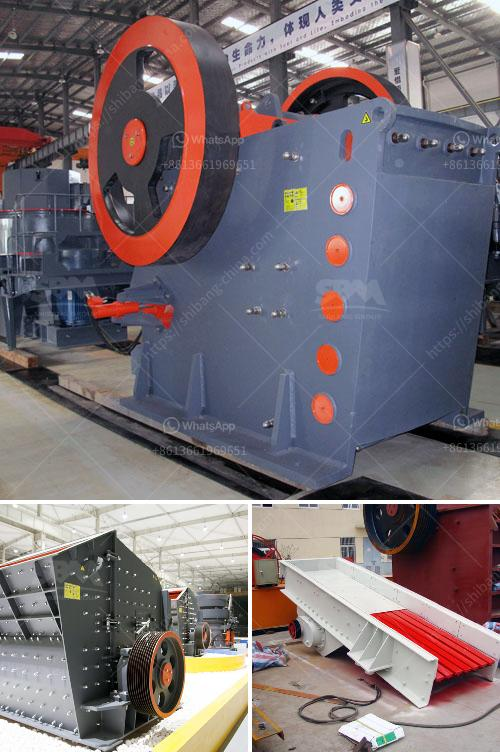

<h3>grinding mills for sale johannesburg</h3>
In the bustling city of Johannesburg, South Africa, commercial and industrial growth is abound. One of the driving forces behind this growth is the ever-evolving mining and manufacturing sectors. These essential industries rely heavily on efficient machinery to ensure smooth operations and increase productivity. Amongst the various machinery types utilized, grinding mills play a significant role in processing raw materials for numerous applications, and Johannesburg offers a wide array of options when it comes to grinding mills for sale.

Grinding mills are crucial equipment used in various industries, including mining, cement, and food processing. These powerful machines are designed to grind desired materials into fine powders or particles to be used in the production process. The process of grinding involves forces such as compression, impact, and attrition, transforming large materials into smaller, more manageable particles.

Johannesburg, commonly known as the "City of Gold," boasts a thriving mining industry. As gold and other valuable minerals are extracted from the mines, they go through immense processing, including grinding, to refine and prepare them for further use. Grinding mills with their ability to break down the minerals into fine particles are an integral part of this process.

Moreover, Johannesburg is also renowned for its massive manufacturing sector, covering industrial sectors such as automotive, steel, and food processing. In these industries, grinding mills are essential for a range of applications. For example, in the food processing industry, grinding mills are used to grind spices, grains, and other ingredients to create a variety of food products.

When searching for grinding mills for sale in Johannesburg, one can find an abundance of options and suppliers catering to the diverse needs of different industries. It's important to consider several factors when making a purchase. Firstly, the capacity of the mill should match the requirements of the production process. It's crucial to ensure that the mill can handle the desired workload efficiently without compromising the final product quality.

Secondly, the type of grinding mill should be considered. There are various types available, including ball mills, vertical mills, and hammer mills, each designed for specific grinding purposes. For example, ball mills are suitable for grinding materials into fine powders, while hammer mills are more suitable for grinding coarse materials.

Additionally, it's imperative to choose a reliable supplier offering quality grinding mills for sale. A reputable supplier should have a track record of providing durable and efficient mills, backed by excellent customer service and after-sales support. Pricing should also be competitive and in line with market standards.

In conclusion, grinding mills are vital equipment in various industries, including mining and manufacturing. Johannesburg boasts a wide range of grinding mills for sale, catering to the diverse needs of different sectors. Whether it's processing raw materials for the mining industry or grinding spices for the food processing sector, finding the right grinding mill in Johannesburg is crucial for efficient and productive operations. By considering factors such as capacity, type of mill, and reliability of the supplier, businesses can ensure they make the best choice when investing in grinding mills for sale in Johannesburg.
<h3>Contact us</h3><ul><li><strong>Whatsapp:&nbsp;<a href="https://wa.me/8613661969651">+8613661969651</a></strong></li><li><a href="https://swt.shibang-china.com/?git&amp;zhl&amp;grinding mills for sale johannesburg"><strong>Online Service(chat now)</strong></a></li></ul><h3>Related</h3><ul><li><a href='roll wheel pulverizer.md'>roll wheel pulverizer</a></li><li><a href='quarrying crusher machine.md'>quarrying crusher machine</a></li><li><a href='iron ore processing plant in mexico.md'>iron ore processing plant in mexico</a></li><li><a href='rock crusher portable.md'>rock crusher portable</a></li><li><a href='cost or operating stone quarry and crusher.md'>cost or operating stone quarry and crusher</a></li></ul>