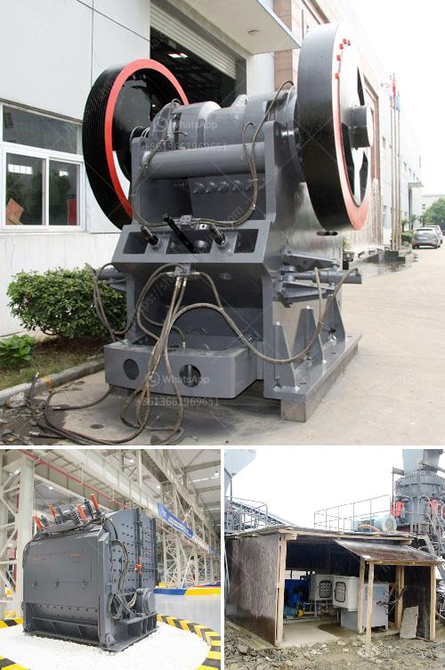

<h3>grinding unit cement plant south africa</h3>
South Africa is experiencing one of its best economic periods in many decades. The country's mining industry plays a crucial role in its economic development. With the increased demand for cement, South Africa's cement industry has witnessed rapid expansion in recent years. This article focuses on the grinding unit cement plant in South Africa, which is among the most advanced and efficient plants in the country.

The cement industry in South Africa has contributed significantly to the country's economic growth and development. The industry has been characterized by the presence of both local and international cement producers. South Africa's growing population and increasing urbanization are driving the demand for cement, resulting in the growth of the industry.

A grinding unit cement plant in South Africa is another sector of the cement industry that the country has invested in to ensure its economic growth. South Africa has 10 cement production plants, and they all produce clinker which is used in the production of cementitious materials. Cement is made from common materials such as limestone, clay, and marl.

The unit cement plant in South Africa can produce 5 million tons of cement annually. The grinding unit is the largest in the country, and it has state-of-the-art technology, which ensures efficient and consistent production of high-quality cement. The grinding unit has a high production capacity, which enables it to meet the growing demand for cement in the country.

The grinding unit cement plant in South Africa is equipped with advanced technology, which ensures the best quality cement production. It is energy efficient and environmentally friendly. The plant has the capacity to produce cement to meet its customers' specific needs and requirements.

The grinding unit cement plant in South Africa provides numerous benefits to the country's economy. It increases the country's cement production capacity, which ensures stability in the supply of cement in the local market. This reduces cement imports, thereby saving foreign exchange. The plant also provides employment opportunities, contributing to job creation and reducing unemployment in South Africa.

In addition to its economic benefits, the grinding unit cement plant also enhances the country's infrastructure development. Quality cement is essential for the construction of buildings, roads, and other infrastructure projects. The plant's production capacity ensures the availability of high-quality cement, contributing to the country's infrastructure development.

The grinding unit cement plant in South Africa is a significant player in the country's cement industry. Not only does it contribute to the country's economic growth and development, but it also provides numerous benefits to the local communities. The plant's advanced technology ensures high-quality cement production that meets the specific needs and requirements of its customers. With the increasing demand for cement in South Africa, the grinding unit cement plant plays a crucial role in ensuring a stable and reliable supply of cement in the country.
<h3>Contact us</h3><ul><li><strong>Whatsapp:&nbsp;<a href="https://wa.me/8613661969651">+8613661969651</a></strong></li><li><a href="https://swt.shibang-china.com/?git&amp;zhl&amp;grinding unit cement plant south africa"><strong>Online Service(chat now)</strong></a></li></ul><h3>Related</h3><ul><li><a href='zevith simple stone crushers kenya.md'>zevith simple stone crushers kenya</a></li><li><a href='suppliers of mining equipment in south africa.md'>suppliers of mining equipment in south africa</a></li><li><a href='mineral cribado cantera planta trituradora.md'>mineral cribado cantera planta trituradora</a></li><li><a href='sand crushing machine.md'>sand crushing machine</a></li><li><a href='germany standard pyrophyllite powder grinding mill.md'>germany standard pyrophyllite powder grinding mill</a></li></ul>