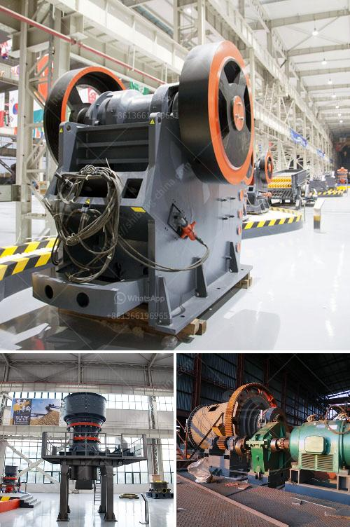

<h3>gypsum board machinery manufacturers turkey</h3>
Gypsum board, also known as drywall or plasterboard, is widely used in the construction industry for creating interior walls and ceilings. It provides a smooth, durable, and fire-resistant surface that is easy to install and maintain. As the demand for gypsum board continues to rise, the need for reliable machinery manufacturers becomes crucial.

Turkey has emerged as a leading player in the global gypsum board industry, with manufacturers producing high-quality machinery to meet both domestic and international needs. These manufacturers are known for their advanced technology, exceptional quality control, and a wide range of equipment options tailored to suit various production requirements.

One of the key factors contributing to the success of gypsum board machinery manufacturers in Turkey is their commitment to innovation and continuous research and development. They invest heavily in state-of-the-art facilities and machinery to ensure optimal performance, efficiency, and product quality. These manufacturers often collaborate with universities and research centers to stay ahead of the technological curve, allowing them to meet the evolving needs of the industry.

Additionally, Turkish gypsum board machinery manufacturers prioritize customer satisfaction. They offer comprehensive after-sales services, including installation, training, and maintenance support to ensure a seamless production process for their clients. This commitment to customer service has garnered a strong reputation for Turkish manufacturers, making them a preferred choice for gypsum board production facilities worldwide.

Furthermore, Turkey's strategic location at the crossroads of Europe and Asia provides manufacturers with access to a vast network of international markets. This advantageous position allows them to efficiently export their machinery to different regions, reinforcing their global presence and enabling them to cater to a diverse range of customers.

In conclusion, gypsum board machinery manufacturers in Turkey have established themselves as industry leaders due to their technological expertise, focus on innovation, and dedication to customer satisfaction. With their advanced machinery and extensive market reach, these manufacturers play a vital role in meeting the growing demand for gypsum board production worldwide.
<h3>Contact us</h3><ul><li><strong>Whatsapp:&nbsp;<a href="https://wa.me/8613661969651">+8613661969651</a></strong></li><li><a href="https://swt.shibang-china.com/?git&amp;zhl&amp;gypsum board machinery manufacturers turkey"><strong>Online Service(chat now)</strong></a></li></ul><h3>Related</h3><ul><li><a href='cost of converyer belts in south africa.md'>cost of converyer belts in south africa</a></li><li><a href='renting of screens and crushers in middelburg.md'>renting of screens and crushers in middelburg</a></li><li><a href='quarrying crusher machine.md'>quarrying crusher machine</a></li><li><a href='nigeria grinding mill.md'>nigeria grinding mill</a></li><li><a href='quartz stone quarry in nigeria.md'>quartz stone quarry in nigeria</a></li></ul>