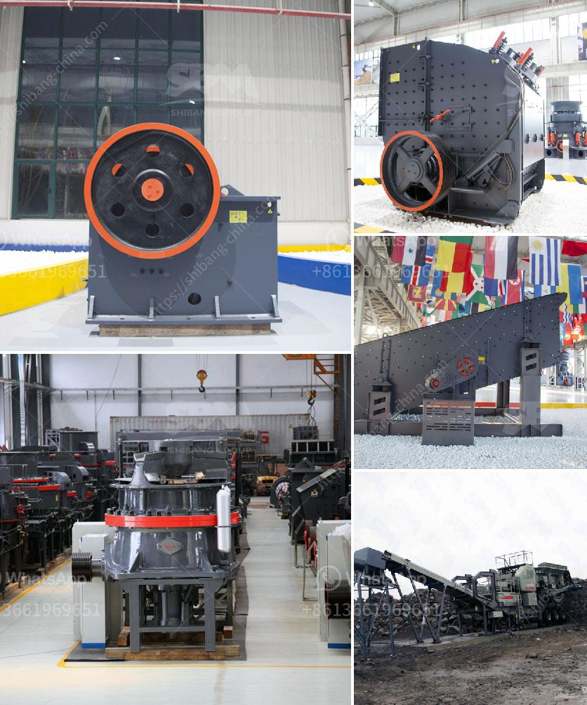

<h3>gypsum board thailand manufacturer</h3>
Gypsum boards have become a popular choice for interior construction due to their versatility, durability, and aesthetic appeal. One prominent player in the industry is the gypsum board Thailand manufacturer. With their commitment to delivering quality and reliability, they have established themselves as a trusted name in the market.

One of the key factors contributing to the success of gypsum board Thailand manufacturers is their access to high-quality gypsum resources. Thailand is blessed with abundant gypsum deposits, allowing manufacturers to have a consistent supply of quality raw materials. This ensures that the final products meet stringent quality standards.

Gypsum board Thailand manufacturers employ advanced and efficient production processes that enable them to deliver superior products. Modern manufacturing facilities equipped with state-of-the-art machinery enable them to produce gypsum boards of various types and sizes, catering to diverse project requirements. These boards are known for their excellent fire resistance, sound insulation, moisture resistance, and durability.

Moreover, gypsum board Thailand manufacturers prioritize research and development, continuously improving their products and innovating new solutions. They invest in exploring advanced technologies and materials to meet ever-evolving customer demands. This commitment to innovation has enabled them to stay ahead of the competition and offer cutting-edge solutions to the market.

In addition to producing high-quality products, gypsum board Thailand manufacturers prioritize customer satisfaction. They work closely with architects, contractors, and project owners to understand their specific needs and deliver tailor-made solutions. Their efficient distribution channels ensure timely delivery, minimizing project delays and maximizing customer satisfaction.

By working with a gypsum board Thailand manufacturer, customers benefit from peace of mind, knowing that they are partnering with a reliable and reputable supplier. These manufacturers adhere to strict quality control measures, conducting thorough inspections at every stage of the production process. This ensures that the final products meet international standards and regulations.

In conclusion, gypsum board Thailand manufacturers have earned their reputation as industry leaders due to their commitment to delivering quality, reliability, and innovation. With their access to high-quality raw materials, advanced production processes, and customer-focused approach, they are well-positioned to meet the growing demands of the construction industry. Whether it's commercial, residential, or industrial projects, partnering with a gypsum board Thailand manufacturer guarantees a seamless and efficient construction experience.
<h3>Contact us</h3><ul><li><strong>Whatsapp:&nbsp;<a href="https://wa.me/8613661969651">+8613661969651</a></strong></li><li><a href="https://swt.shibang-china.com/?git&amp;zhl&amp;gypsum board thailand manufacturer"><strong>Online Service(chat now)</strong></a></li></ul><h3>Related</h3><ul><li><a href='used coal washing plant sale.md'>used coal washing plant sale</a></li><li><a href='cost of setting up a mini cement plant in india.md'>cost of setting up a mini cement plant in india</a></li><li><a href='stone crusher in ksa.md'>stone crusher in ksa</a></li><li><a href='cost to setup cement plant industry.md'>cost to setup cement plant industry</a></li><li><a href='mobile crusher machine in iran.md'>mobile crusher machine in iran</a></li></ul>