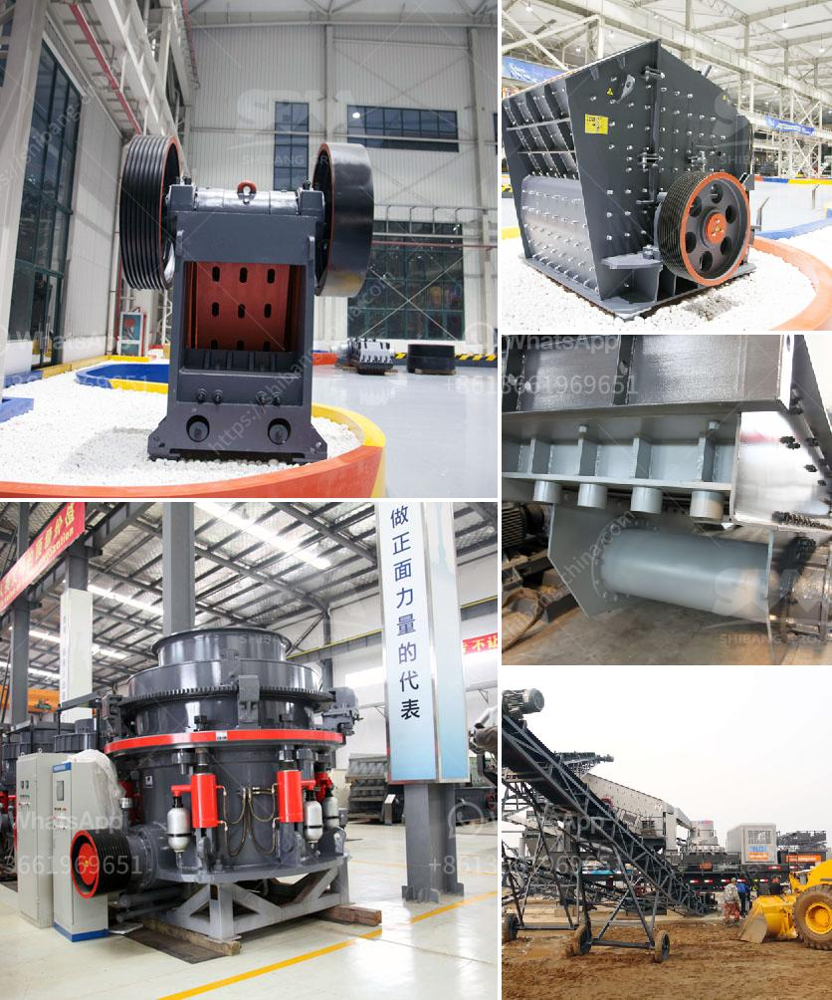

<h3>gypsum granules machine in india</h3>
Gypsum is a mineral widely used in construction, agriculture, and various other industries. It is a key component in soil conditioning, as it helps improve the structure and nutrient-holding capacity of soils. India, being an agro-based economy, heavily relies on gypsum for its agricultural activities. To meet the growing demand for gypsum, manufacturers have introduced advanced machinery like the gypsum granules machine in India.

The gypsum granules machine is a compact system designed to produce small granules of gypsum for use in various applications. These machines are ideal for farmers and organizations looking to enhance soil fertility and improve crop yield. The granules produced by these machines are well-suited for direct application in the soil.

One of the primary benefits of using a gypsum granules machine is its efficiency in converting raw gypsum into granules. The machine operates on a continuous process, combining various components like gypsum powder, binders, and additives to produce uniform-sized granules. The uniformity of the granules ensures consistent application and distribution across the soil.

Moreover, the gypsum granules machine in India is known for its easy operation and maintenance. The machine is equipped with high-quality components that minimize downtime and ensure reliable performance. Additionally, manufacturers provide comprehensive training and support to users, enabling them to operate the machines efficiently.

The granules produced by these machines have several advantages over traditional methods of gypsum application. The granules are dust-free, making them easier and safer to handle. They also eliminate the need for additional time-consuming processes like weighing and mixing, as they can be directly applied to the soil. These factors contribute to increased efficiency, reduced labor costs, and improved productivity for farmers.

Furthermore, the use of gypsum granules is environmentally friendly. Gypsum is a non-toxic mineral, and its granules do not harm the environment or pose a risk to human health. By using granules instead of powdered gypsum, farmers can minimize dust emissions during handling and application, reducing air pollution.

In addition to agricultural applications, gypsum granules have other uses as well. They can be utilized in the construction industry for manufacturing gypsum boards, plasterboard, and other building materials. The granules act as a binding agent, contributing to the strength and durability of the final product.

Overall, the gypsum granules machine in India has revolutionized the gypsum industry by streamlining the manufacturing process and improving the efficiency of gypsum application. It offers significant benefits for farmers, organizations, and industries relying on gypsum for various purposes. By using granules, users can experience enhanced soil fertility, increased crop yield, reduced labor costs, and improved product quality. Moreover, the environmentally friendly nature of gypsum granules makes them a preferred choice for sustainable agriculture and construction practices.

In conclusion, the introduction of the gypsum granules machine in India has had a positive impact on the gypsum industry and agriculture sector. With the machine's efficiency, ease of operation, and environmental benefits, it has gained popularity among farmers and other users. As the demand for gypsum continues to grow, the gypsum granules machine will play a crucial role in meeting the needs of the Indian market.
<h3>Contact us</h3><ul><li><strong>Whatsapp:&nbsp;<a href="https://wa.me/8613661969651">+8613661969651</a></strong></li><li><a href="https://swt.shibang-china.com/?git&amp;zhl&amp;gypsum granules machine in india"><strong>Online Service(chat now)</strong></a></li></ul><h3>Related</h3><ul><li><a href='sand washing machine.md'>sand washing machine</a></li><li><a href='raymond ultra fine grinding mill.md'>raymond ultra fine grinding mill</a></li><li><a href='clinker grinding unit for cement clinker in india.md'>clinker grinding unit for cement clinker in india</a></li><li><a href='crushing plants pawer screen.md'>crushing plants pawer screen</a></li><li><a href='busines project proposal for stone crusher.md'>busines project proposal for stone crusher</a></li></ul>