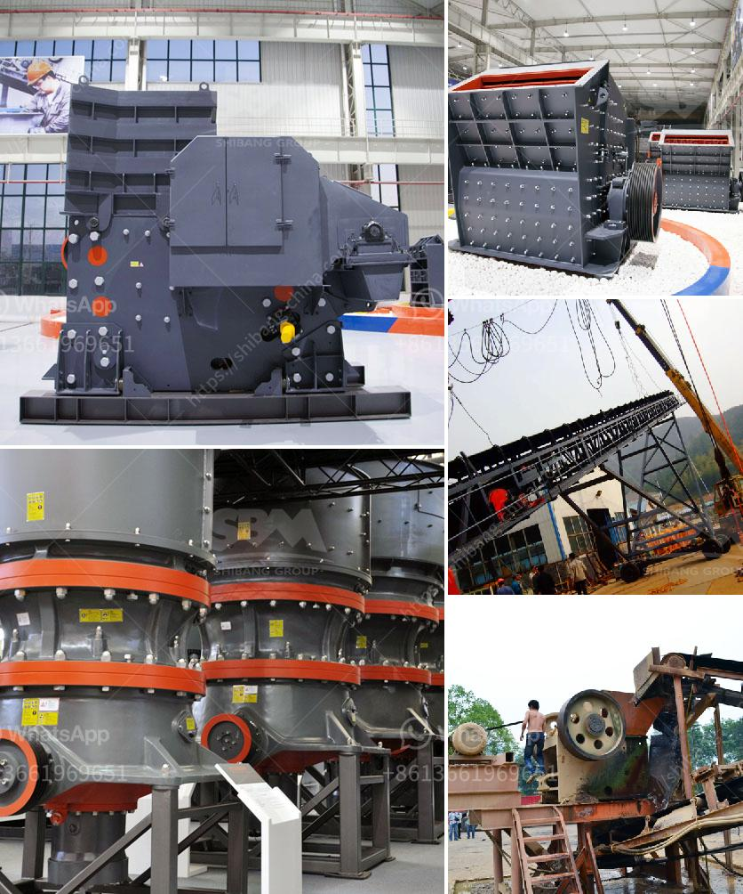

<h3>gypsum machinery plant from france</h3>
France has long been renowned for its architectural grandeur, with unique buildings and iconic monuments gracing its landscape. Behind these awe-inspiring structures lies a high-quality construction material known as gypsum. Utilized for centuries, gypsum has proven to be an essential ingredient in the construction industry due to its versatility, durability, and eco-friendliness. France takes pride in its gypsum production, offering an outstanding gypsum machinery plant that sets a benchmark in construction material production.

One of the leading providers of gypsum machinery plants in France is renowned for its state-of-the-art technology, which guarantees the production of top-grade gypsum products. This machinery plant offers a comprehensive range of equipment, including crushers, mills, calcination units, plasterboard production lines, and more. With a focus on innovation, effectiveness, and sustainability, these machinery plants have cemented their position as industry leaders.

One of the key highlights of these gypsum machinery plants is the advanced crushing equipment they boast. This modern machinery ensures that gypsum ores are efficiently extracted, crushed, and prepared for further processing. By utilizing high-performance crushers, these plants produce gypsum powder with superior fineness and consistency, laying the foundation for flawless construction projects.

To achieve the desired gypsum powder specifications, gypsum machinery plants in France employ cutting-edge mills. These milling systems excel at grinding gypsum into a powder of different grain sizes, allowing for precise customization according to project requirements. The sophisticated technology behind these mills guarantees minimal energy consumption while maintaining optimal production rates.

Calcination units are another essential component of the gypsum machinery plants in France. These units play a crucial role in transforming raw gypsum into high-quality plaster. With advanced temperature control systems, they facilitate the removal of excess water from the gypsum, ensuring improved hardness, strength, and workability. The resulting gypsum plaster becomes an ideal material for a wide range of construction applications, from interior walls to decorative moldings and ceiling tiles.

Furthermore, gypsum machinery plants from France excel in the production of plasterboards, a widely-used construction material. Automated plasterboard production lines ensure high efficiency and consistent quality throughout the manufacturing process. These lines handle various stages, including forming the gypsum slurry, applying it to belts, drying, cutting, and packaging. The final product, gypsum boards, possesses exceptional fire resistance, sound insulation, and durability, making them an excellent choice for modern construction projects.

Apart from their technical prowess, gypsum machinery plants in France prioritize sustainability. Consistent with France's commitment to environmental preservation, these plants utilize eco-friendly manufacturing processes and practices. From minimizing waste generation and optimizing energy efficiency to recycling water and reducing carbon emissions, they embody a responsible approach towards construction material production.

In conclusion, the gypsum machinery plants from France set a benchmark in construction material production, epitomizing excellence, advancement, and environmental responsibility. These plants showcase remarkable capabilities, from efficient ore extraction and crushing to state-of-the-art milling and plasterboard production. By incorporating cutting-edge technology and embracing sustainability, they continue to contribute to the construction industry's growth and development. With France's unmatched architectural heritage and the support of these gypsum machinery plants, the construction world can continue building remarkable structures while embracing sustainability.
<h3>Contact us</h3><ul><li><strong>Whatsapp:&nbsp;<a href="https://wa.me/8613661969651">+8613661969651</a></strong></li><li><a href="https://swt.shibang-china.com/?git&amp;zhl&amp;gypsum machinery plant from france"><strong>Online Service(chat now)</strong></a></li></ul><h3>Related</h3><ul><li><a href='chrome processing and drying.md'>chrome processing and drying</a></li><li><a href='mining equipment tanzania.md'>mining equipment tanzania</a></li><li><a href='cinder block crushing machines for rent.md'>cinder block crushing machines for rent</a></li><li><a href='bentonite grinding machine manufacturer in india.md'>bentonite grinding machine manufacturer in india</a></li><li><a href='quarry crusher equipment for sale brisbane.md'>quarry crusher equipment for sale brisbane</a></li></ul>