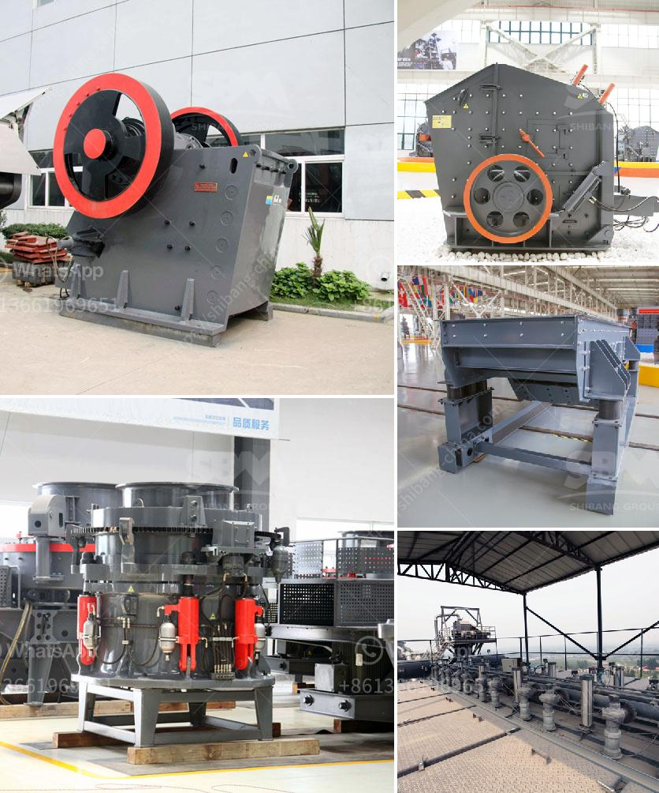

<h3>gypsum making machine india</h3>
Gypsum is a versatile material that is used in various applications such as construction, agriculture, and industrial manufacturing. It is a soft mineral, composed of calcium sulfate dihydrate, which makes it ideal for numerous purposes. In recent years, there has been a growing demand for gypsum in India, leading to the emergence of gypsum making machines in the market.

Gypsum board is the most common form of gypsum used in construction projects. It is made by mixing gypsum powder with water and other additives to form a slurry, which is then poured onto a layer of paper and pressed between two sheets of paper. The resulting board is then dried and cut into sheets of the desired size.

Traditionally, gypsum boards were made manually, which required a lot of time and effort. However, with the advancement of technology, gypsum making machines have been developed to automate the process, making it quicker, more efficient, and cost-effective.

The gypsum making machine in India is designed and manufactured by industry-leading companies that have a vast experience in this sector. These machines are made using high-quality materials and advanced technology to ensure optimum performance and durability. They are easy to operate and require minimal maintenance, making them suitable for small and large-scale gypsum production.

One of the key advantages of using gypsum making machines is the consistency and precision they offer in the production process. The machines ensure that the gypsum slurry is mixed thoroughly, eliminating any lumps or unevenness in the final product. This results in high-quality gypsum boards with smooth surfaces and uniform thickness, which are essential for various construction projects.

Furthermore, gypsum making machines in India are equipped with advanced control systems that allow operators to adjust parameters such as water-to-gypsum ratio and drying time, according to specific requirements. This flexibility enables manufacturers to produce gypsum boards of different strengths, dimensions, and fire resistance levels, catering to the diverse needs of the market.

The growing demand for gypsum boards in India has facilitated the establishment of gypsum board manufacturing plants across the country. These plants are equipped with state-of-the-art gypsum making machines, enabling them to produce a large volume of high-quality gypsum boards efficiently. This has not only helped meet the domestic demand but has also opened up opportunities for exports, contributing to the growth of the Indian economy.

In conclusion, gypsum making machines in India have revolutionized the gypsum board manufacturing industry. They have improved productivity, ensured consistent quality, and enhanced the competitiveness of Indian gypsum board manufacturers. With their advanced features and efficient performance, these machines continue to play a crucial role in meeting the increasing demand for gypsum boards in the construction sector.
<h3>Contact us</h3><ul><li><strong>Whatsapp:&nbsp;<a href="https://wa.me/8613661969651">+8613661969651</a></strong></li><li><a href="https://swt.shibang-china.com/?git&amp;zhl&amp;gypsum making machine india"><strong>Online Service(chat now)</strong></a></li></ul><h3>Related</h3><ul><li><a href='grinder rock crusher.md'>grinder rock crusher</a></li><li><a href='100tpd complete gold plant.md'>100tpd complete gold plant</a></li><li><a href='portable stone crusher machine for sale.md'>portable stone crusher machine for sale</a></li><li><a href='crusher plant for sale in mardan.md'>crusher plant for sale in mardan</a></li><li><a href='price list of washing of rock phosphate.md'>price list of washing of rock phosphate</a></li></ul>