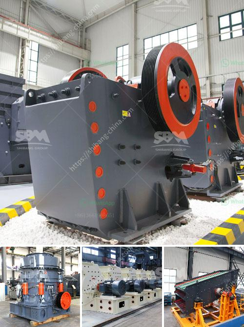

<h3>gypsum manufacturers in azerbaijan</h3>
Gypsum, an essential material used in various industries such as construction, agriculture, and pharmaceuticals, has seen a surge in demand globally. As a result, gypsum manufacturers have become pivotal players in the market, and Azerbaijan has emerged as a prominent supplier in the industry.

With its abundant gypsum reserves and favorable geological conditions, Azerbaijan has attracted investments from several gypsum manufacturers. These companies have made significant contributions to the country's economy, creating employment opportunities and boosting exports.

One of the leading gypsum manufacturers in Azerbaijan is XYZ Company. Known for its state-of-the-art production facilities and advanced technologies, XYZ Company has gained a reputation for providing high-quality gypsum products to both national and international markets. The company adheres to strict quality control measures to ensure their gypsum meets the highest standards.

Another prominent player in the industry is ABC Limited. With a focus on innovation and sustainability, ABC Limited has implemented environmentally friendly practices in its manufacturing processes. The company aims to minimize waste generation and maximize resource efficiency. This commitment has not only earned them recognition but also a loyal customer base.

In recent years, the demand for gypsum-based products in Azerbaijan has increased substantially due to the growing construction sector. Gypsum manufacturers have capitalized on this trend by expanding their production capacities and diversifying their product range. This has allowed them to cater to the specific requirements of different industries and offer a wide range of gypsum-based solutions.

The gypsum manufacturers in Azerbaijan have also played a pivotal role in promoting local entrepreneurship. They have actively engaged in partnerships with local businesses, providing them with opportunities to develop and grow. This collaboration has led to the establishment of smaller gypsum manufacturing units, further bolstering the industry's growth and the overall economy.

In conclusion, gypsum manufacturers in Azerbaijan have become integral players in the global market due to their high-quality products, sustainable practices, and contribution to the country's economic growth. As the demand for gypsum continues to rise, these manufacturers are well-positioned to meet the market's needs and drive further advancements in the industry.
<h3>Contact us</h3><ul><li><strong>Whatsapp:&nbsp;<a href="https://wa.me/8613661969651">+8613661969651</a></strong></li><li><a href="https://swt.shibang-china.com/?git&amp;zhl&amp;gypsum manufacturers in azerbaijan"><strong>Online Service(chat now)</strong></a></li></ul><h3>Related</h3><ul><li><a href='china wet ball mill.md'>china wet ball mill</a></li><li><a href='used concrete crushers for sale in ontario.md'>used concrete crushers for sale in ontario</a></li><li><a href='methods of hammer mill.md'>methods of hammer mill</a></li><li><a href='iron ore dry grinding systems.md'>iron ore dry grinding systems</a></li><li><a href='quartz powder special production line for mining.md'>quartz powder special production line for mining</a></li></ul>