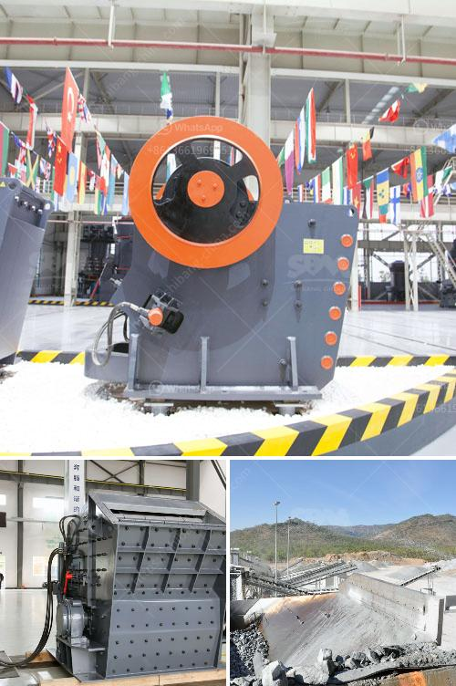

<h3>gypsum powder production business plan</h3>
Gypsum powder is widely used in construction, building materials, and other industries. It can be used as cement retarder, gypsum building products, model making, medical food additives, sulfuric acid production, paper filler, paint fillers, etc. In order to effectively utilize gypsum powder, the demand for gypsum powder is increasing worldwide. This presents a great opportunity for entrepreneurs to venture into the gypsum powder production business.

Developing a gypsum powder production business plan should be a top priority for entrepreneurs aspiring to venture into this lucrative industry. The key components of a successful business plan include a clear mission statement, a detailed product description, an analysis of potential buyers and competitors, a marketing and sales strategy, financial projections, and a thorough risk assessment.

First and foremost, it is important to define the mission of the business. What is the purpose of producing gypsum powder? Is it to meet the increasing demand in the construction industry or to supply other industries? Answering these questions will provide a clear direction for the business.

The product description should detail the process of producing gypsum powder, including the raw materials required, the equipment needed, and the production capacity. It is crucial to conduct thorough research on the quality and availability of raw materials to ensure a steady supply.

Identifying potential buyers and understanding competitors is essential for a successful business plan. Are there local or international markets for gypsum powder? Who are the major buyers? Who are the competitors and what are their strengths and weaknesses? Analyzing these factors will help in formulating a competitive marketing and sales strategy.

Financial projections should include a detailed estimation of the initial investment required, operating costs, and revenue projections. It is important to consider both short-term and long-term goals to ensure the financial viability of the business.

Lastly, conducting a thorough risk assessment is crucial to identify potential challenges and develop contingency plans. This could include factors such as changes in government policies, fluctuations in raw material prices, or market saturation.

In conclusion, venturing into the gypsum powder production business can be a lucrative venture if a comprehensive business plan is developed. By considering the mission, product description, market analysis, marketing strategy, financial projections, and risk assessment, entrepreneurs can effectively plan and execute their business for success in this industry.
<h3>Contact us</h3><ul><li><strong>Whatsapp:&nbsp;<a href="https://wa.me/8613661969651">+8613661969651</a></strong></li><li><a href="https://swt.shibang-china.com/?git&amp;zhl&amp;gypsum powder production business plan"><strong>Online Service(chat now)</strong></a></li></ul><h3>Related</h3><ul><li><a href='china gold dry washer manufacturer in philippines.md'>china gold dry washer manufacturer in philippines</a></li><li><a href='stone crusher sri lanka.md'>stone crusher sri lanka</a></li><li><a href='jaw crusher dealer in dubai.md'>jaw crusher dealer in dubai</a></li><li><a href='crusher machine for sale in ethiopia.md'>crusher machine for sale in ethiopia</a></li><li><a href='gravel crushers in saskatchewan for sale.md'>gravel crushers in saskatchewan for sale</a></li></ul>