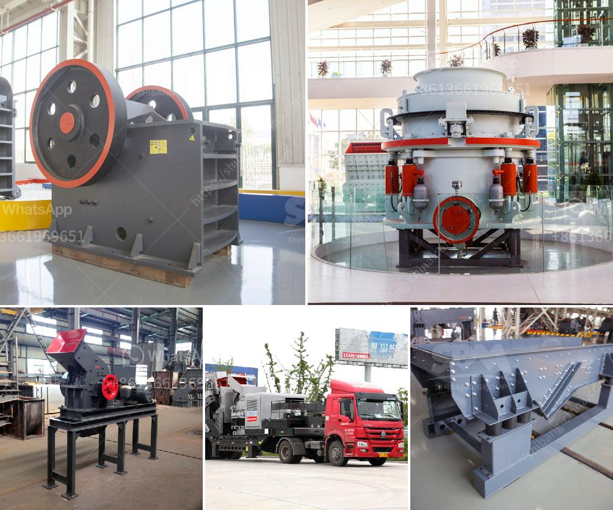

<h3>gypsum production line in spain for sale</h3>
Gypsum, a mineral commonly used for making drywall, is found in abundance throughout Spain. Although Spain has a long history of extracting and processing gypsum, the country is still home to vast, untapped gypsum reserves. As a result, the demand for gypsum production lines in Spain is steadily increasing.

One of the main reasons for the growing interest in gypsum production lines in Spain is the booming construction industry. As the economy recovers from the global financial crisis, construction projects are on the rise, creating a need for building materials like drywall. Gypsum, with its fire-resistant and soundproofing properties, is a popular choice in the construction sector.

To meet the growing demand for gypsum, manufacturers are turning to advanced production lines that can efficiently and effectively process the mineral. These production lines are designed to extract and refine gypsum from its natural state, resulting in high-quality material suitable for a variety of applications.

Spain, being a frontrunner in the gypsum industry, offers a wide range of production line options for sale. These production lines are designed by leading manufacturers who have extensive experience in the field. Spanish gypsum production lines are known for their reliability, durability, and advanced technology. They can handle large volumes of gypsum, ensuring a steady supply for construction projects.

Additionally, Spain's favorable business environment makes it an ideal location for gypsum production line purchases. The country has a well-established infrastructure, including transportation networks and access to raw materials. This allows for streamlined production processes and cost-efficient operations.

There are several types of gypsum production lines available for sale in Spain, depending on the specific needs of the buyer. Some production lines are designed for small-scale operations, while others cater to larger industrial facilities. The choice of production line depends on factors such as desired output capacity, available space, and budget.

Buyers can also choose between fully automated or semi-automated production lines. Fully automated lines offer maximum efficiency and require minimal manual intervention. On the other hand, semi-automated lines provide more flexibility and allow for customization.

In conclusion, the gypsum production industry in Spain is experiencing a surge in demand due to the country's construction boom. As a result, there is a wide selection of gypsum production lines available for sale. These production lines are renowned for their quality, efficiency, and advanced technology. Spanish gypsum production lines are an excellent investment for businesses looking to capitalize on the growing demand for gypsum in the construction sector. With Spain's favorable business environment and abundance of gypsum reserves, now is the perfect time to consider purchasing a gypsum production line in Spain.
<h3>Contact us</h3><ul><li><strong>Whatsapp:&nbsp;<a href="https://wa.me/8613661969651">+8613661969651</a></strong></li><li><a href="https://swt.shibang-china.com/?git&amp;zhl&amp;gypsum production line in spain for sale"><strong>Online Service(chat now)</strong></a></li></ul><h3>Related</h3><ul><li><a href='equipment for grinding calcium carbonate.md'>equipment for grinding calcium carbonate</a></li><li><a href='roller mill grinder.md'>roller mill grinder</a></li><li><a href='indonesia quality crusher conveyor belts.md'>indonesia quality crusher conveyor belts</a></li><li><a href='difference between raymond mill and vertical roller mill.md'>difference between raymond mill and vertical roller mill</a></li><li><a href='jaw crusher seller in pakistan.md'>jaw crusher seller in pakistan</a></li></ul>