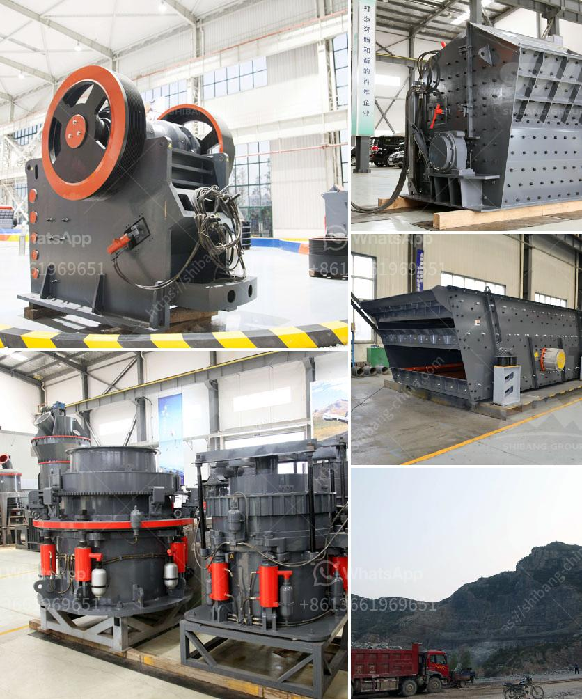

<h3>gypsum production line used</h3>
Gypsum is a mineral composed of calcium sulfate dihydrate (CaSO4·2H2O) that is commonly used in building materials, such as drywall, plaster, and cement. The process of gypsum production involves extracting, crushing, and grinding the gypsum ore into powder. This powder is then used in a variety of applications such as construction materials, industrial processes, and agricultural practices.

The gypsum production line is a series of equipment that deals with the processing of gypsum into a finished product. It mainly includes the crushing, grinding, and calcination of gypsum. The crushing equipment used in the production line is initially used to crush the large-sized gypsum ore into smaller particles, which are then sent to the grinding mill for further processing.

In the grinding mill, the gypsum particles are ground into a fine powder, which is then sieved to ensure uniformity in the particle size. This powdered gypsum is then sent to the calcination equipment, where it is heated at high temperatures to remove any remaining water content, resulting in the formation of calcium sulfate hemihydrate (CaSO4·1/2H2O). This hemihydrate is commonly known as plaster of Paris or stucco, and it has various applications in the construction industry.

The gypsum production line plays a vital role in providing the necessary gypsum materials for numerous building projects. It not only ensures the availability of gypsum in the market but also delivers a consistent quality that meets the required standards. This is crucial for achieving the desired strength, durability, and fire resistance in the final construction materials.

Moreover, the gypsum production line also contributes to sustainable practices. Gypsum is a natural and non-toxic mineral, which makes it an environmentally friendly choice for building materials. Additionally, the use of byproducts, such as flue gas desulfurization gypsum, in the production process helps reduce waste and promote circular economy principles.

In conclusion, the gypsum production line is an essential component of the construction industry, providing high-quality gypsum materials for various applications. With its efficient processing methods and sustainable practices, the production line contributes to the development of safe, durable, and environmentally friendly buildings.
<h3>Contact us</h3><ul><li><strong>Whatsapp:&nbsp;<a href="https://wa.me/8613661969651">+8613661969651</a></strong></li><li><a href="https://swt.shibang-china.com/?git&amp;zhl&amp;gypsum production line used"><strong>Online Service(chat now)</strong></a></li></ul><h3>Related</h3><ul><li><a href='kenya electrical jaw crusher 32 x 58.md'>kenya electrical jaw crusher 32 x 58</a></li><li><a href='granite machine concrete.md'>granite machine concrete</a></li><li><a href='calcium carbonate limestone machine.md'>calcium carbonate limestone machine</a></li><li><a href='second hand stone crusher sale in india.md'>second hand stone crusher sale in india</a></li><li><a href='granite crusher manufacturer.md'>granite crusher manufacturer</a></li></ul>