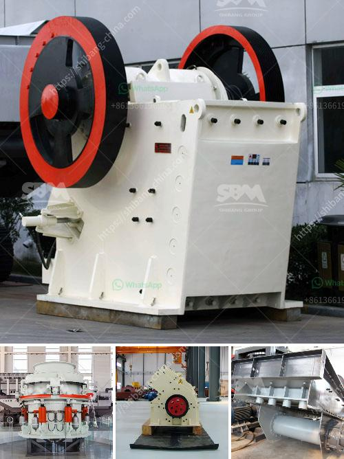

<h3>gypsum production plant</h3>
Gypsum is a naturally occurring mineral that is commonly used in various industries, including construction and agriculture. It is widely praised for its ability to improve soil structure, enhance plant growth, and provide essential nutrients to crops. As the demand for gypsum continues to rise, gypsum production plants have become essential facilities to meet this demand.

A gypsum production plant is a facility where gypsum is extracted from the ground and refined into a powder form. From this powder, various gypsum products can be manufactured, including gypsum boards, drywall, plaster, and fertilizers. Gypsum production plants are similar to other mining and quarrying facilities, as they involve extracting and processing minerals for commercial use.

The process of gypsum production starts with the mining of the gypsum deposit. This involves drilling and blasting the rock, followed by removing it using heavy machinery. Once the gypsum is extracted, it is then transported to the production plant for further processing.

At the production plant, the extracted gypsum is crushed into smaller pieces and heated in a kiln. This heating process, known as calcination, removes any remaining impurities and water from the gypsum, resulting in a fine powder called stucco. The stucco is then stored in silos for further use in manufacturing gypsum products.

Gypsum production plants play a vital role in supporting the construction industry. Gypsum boards, for example, are widely used for interior walls and ceilings, providing excellent fire resistance and soundproofing. Plaster, on the other hand, is used for creating decorative finishes on walls and ceilings. Gypsum-based fertilizers are also popular in agriculture, as they enhance soil fertility and improve crop yields.

In recent years, gypsum production plants have made efforts to reduce their environmental impact through the use of sustainable practices. This includes finding innovative ways to minimize waste, conserve water, and reduce energy consumption during the production process. Additionally, some gypsum production plants have started utilizing synthetic gypsum, a byproduct of coal-fired power plants, as an alternative to naturally occurring gypsum, further promoting environmental sustainability.

In conclusion, gypsum production plants are integral to meeting the growing demand for gypsum in various industries. These facilities extract, process, and refine gypsum into a fine powder that is used to manufacture a wide range of products. With their contribution to the construction and agricultural sectors, coupled with efforts towards sustainability, gypsum production plants are crucial in ensuring a sustainable future.
<h3>Contact us</h3><ul><li><strong>Whatsapp:&nbsp;<a href="https://wa.me/8613661969651">+8613661969651</a></strong></li><li><a href="https://swt.shibang-china.com/?git&amp;zhl&amp;gypsum production plant"><strong>Online Service(chat now)</strong></a></li></ul><h3>Related</h3><ul><li><a href='grinding mill for limestone italy.md'>grinding mill for limestone italy</a></li><li><a href='manufacturer of ultrafine machine india.md'>manufacturer of ultrafine machine india</a></li><li><a href='dolomite crusher manufacturing plant.md'>dolomite crusher manufacturing plant</a></li><li><a href='vrm cement grinding.md'>vrm cement grinding</a></li><li><a href='jaw stone crusher for excavators.md'>jaw stone crusher for excavators</a></li></ul>