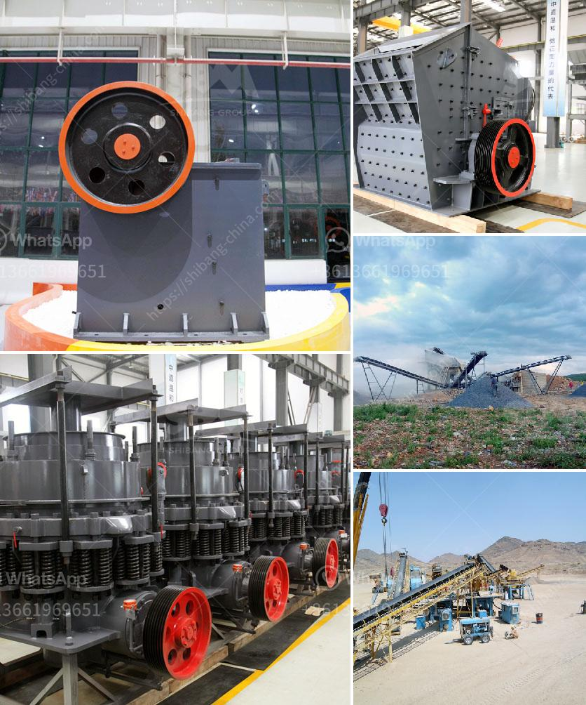

<h3>gyratory crusher prices</h3>
Gyratory crushers are used in various industries and are primarily used for large ore or rock reduction. They are considered to be extremely reliable and require very little maintenance, making them a popular choice for mining operations. However, the cost of a gyratory crusher is often high, making it impractical for smaller operations.

Gyratory crusher prices can range from $4 million to upwards of $10 million, with the average price being around $6 million. These costs are directly related to the features and capabilities of the crusher and are influenced by various factors including the size of the crusher, the type of material it is designed to process, and the production capacity.

One of the primary factors influencing the price of a gyratory crusher is its size. Crushers that are larger in size have a higher capacity and can process more ore or rock per hour. However, larger crushers require more robust components and more power, which can significantly increase their cost. Smaller crushers, on the other hand, are more affordable but have lower production capacities.

The type of material a gyratory crusher is designed to process also affects its price. Different materials have varying degrees of hardness and abrasiveness, which can impact the design and construction of the crusher. For example, a crusher designed to process hard and abrasive ores will typically have more expensive wear parts and a more robust construction. These added features and components increase the cost of the crusher.

The production capacity of a gyratory crusher is another important factor that determines its price. Crushers with higher production capacities are generally more expensive due to the increased size and power requirements. This is particularly true for crushers used in large mining operations, where high volumes of ore or rock need to be processed on a continuous basis.

In addition to these factors, the brand and reputation of the crusher manufacturer can also impact its price. Well-known brands with a proven track record of reliability and performance often command a higher price tag. These manufacturers invest heavily in research and development, ensuring that their crushers are of the highest quality and incorporate the latest technological advancements.

While the cost of a gyratory crusher may be high, it is important to consider the long-term benefits and savings it can provide. Gyratory crushers are known for their durability and low operating costs. They require less maintenance and have a longer lifespan compared to other crushing equipment. Additionally, their large capacity allows for efficient processing of large volumes of ore or rock, resulting in increased productivity.

In conclusion, gyratory crusher prices can vary significantly depending on the size, material, production capacity, and manufacturer. While the initial investment may be high, these crushers offer long-term benefits in terms of reliability, low operating costs, and increased productivity. It is important for potential buyers to carefully consider their specific needs and requirements before making a purchase to ensure that they select a crusher that is both efficient and cost-effective.
<h3>Contact us</h3><ul><li><strong>Whatsapp:&nbsp;<a href="https://wa.me/8613661969651">+8613661969651</a></strong></li><li><a href="https://swt.shibang-china.com/?git&amp;zhl&amp;gyratory crusher prices"><strong>Online Service(chat now)</strong></a></li></ul><h3>Related</h3><ul><li><a href='buy crushing and screening plant manufacture turkey.md'>buy crushing and screening plant manufacture turkey</a></li><li><a href='small concrete crusher for sale.md'>small concrete crusher for sale</a></li><li><a href='rock crusher plant cost.md'>rock crusher plant cost</a></li><li><a href='ansporting coal conveyor belt.md'>ansporting coal conveyor belt</a></li><li><a href='feasibility study for gypsum powder production line.md'>feasibility study for gypsum powder production line</a></li></ul>