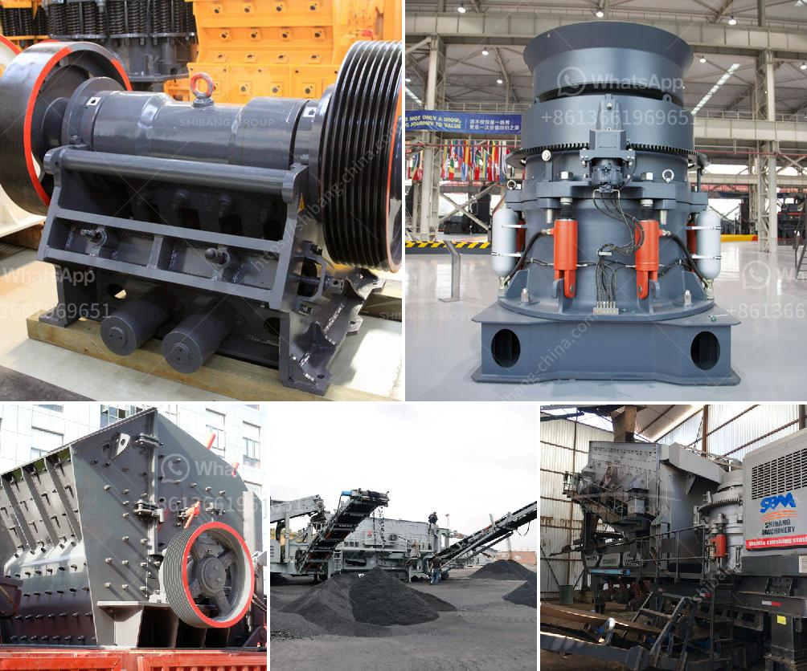

<h3>hammer grinding machine philippines</h3>
The Philippines is known for its rich natural resources that have contributed greatly to the nation's economic growth. Over the years, the country has been tapping into its vast reserves of mineral deposits such as copper, gold, nickel, and chromite. With the continuous extraction of these minerals, various industries have emerged, relying heavily on machinery and equipment to aid in the processing and manufacturing processes.

One essential machine that Filipino workshops should have is a hammer grinding machine. It is a versatile and powerful tool that can transform raw materials into smaller and more manageable sizes. The machine's main purpose is to crush and grind different materials such as grains, wood chips, and other biomass materials.

One of the primary uses of a hammer grinding machine is in the agricultural sector. Farmers and animal feed producers greatly benefit from this machine as it allows them to process different types of grains for animal consumption. With the growing demand for livestock and poultry products in the Philippines, the need for high-quality animal feed has become crucial. Hammer grinding machines ensure that the feed is finely ground, making it easy for animals to digest and absorb the necessary nutrients.

Aside from agriculture, the hammer grinding machine is also extensively used in the manufacturing industry, particularly in paper and wood processing. Woodworking businesses rely on this machine to grind wood chips into smaller particles used for various purposes. By breaking down the wood chips, the machine enhances the efficiency of the wood processing, making it easier to create furniture, panels, and other wood products.

Furthermore, the hammer grinding machine is also utilized in recycling facilities. By shredding and grinding plastic materials, the machine aids in the recycling process, turning waste into valuable resources. As the importance of environmental sustainability continues to grow in the country, the demand for recycling facilities and equipment increases. The hammer grinding machine is an indispensable tool to ensure proper waste management and recycling.

In recent years, the demand for hammer grinding machines has surged due to the construction boom in the Philippines. With numerous infrastructure projects such as roads, bridges, and buildings being built across the country, there is a need for efficient machinery to crush and grind construction materials. The machine's versatility allows it to process different types of rocks, cement, and other construction materials, making it an essential tool for contractors and construction companies.

In conclusion, the hammer grinding machine is a must-have tool in every workshop in the Philippines. Its versatile nature and multiple applications make it invaluable in various industries, including agriculture, manufacturing, recycling, and construction. As technology continues to improve and innovation in machinery takes place, the hammer grinding machine remains a reliable tool for businesses and individuals seeking efficient material processing. By investing in this machine, Filipino workshops can optimize their productivity and contribute to the growth and development of the nation's economy.
<h3>Contact us</h3><ul><li><strong>Whatsapp:&nbsp;<a href="https://wa.me/8613661969651">+8613661969651</a></strong></li><li><a href="https://swt.shibang-china.com/?git&amp;zhl&amp;hammer grinding machine philippines"><strong>Online Service(chat now)</strong></a></li></ul><h3>Related</h3><ul><li><a href='aggregate crusher plant layout.md'>aggregate crusher plant layout</a></li><li><a href='crusher materials cone crusher mining.md'>crusher materials cone crusher mining</a></li><li><a href='crushing stone machines for sale in usa.md'>crushing stone machines for sale in usa</a></li><li><a href='ultra fine grinding equipment.md'>ultra fine grinding equipment</a></li><li><a href='aggregate for cement block making.md'>aggregate for cement block making</a></li></ul>