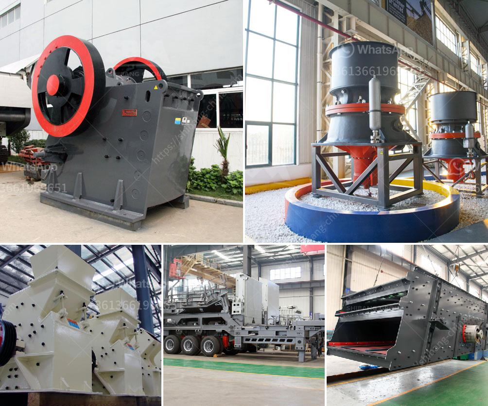

<h3>hammer mill dimension for 15tph</h3>
The dimensions of a hammer mill is a significant factor to consider when purchasing a unit to meet the specific requirements of a production line. It is important to consider factors such as the screen area, horsepower, and the throughput capacity when looking for a hammer mill for a 15tph operation. 

One of the key dimensions to consider is the screen area. The screen area determines the amount of material that can be processed by the hammer mill at a given time. A larger screen area allows for a higher throughput capacity and a more efficient grinding process. It is essential to select a hammer mill with an adequate screen area to ensure that the desired production rate can be achieved.

Another crucial dimension is the horsepower of the hammer mill. The horsepower directly affects the grinding capacity and efficiency of the mill. A higher horsepower allows for more grinding power, enabling the mill to process a larger volume of material in a shorter period. It is vital to select a hammer mill with sufficient horsepower to handle the desired production rate and the characteristics of the material being processed.

The throughput capacity of the hammer mill is directly dependent on the screen area, horsepower, and the characteristics of the material. It is crucial to choose a hammer mill that can handle the specific material and production requirements. A 15tph production rate necessitates a mill with a high throughput capacity to maintain the desired output level.

In conclusion, selecting a hammer mill with the appropriate dimensions is paramount when considering a 15tph operation. The screen area, horsepower, and throughput capacity are essential factors to consider when looking for a suitable hammer mill. By choosing a mill with the right dimensions, one can ensure efficient grinding and achieve the desired production rate.
<h3>Contact us</h3><ul><li><strong>Whatsapp:&nbsp;<a href="https://wa.me/8613661969651">+8613661969651</a></strong></li><li><a href="https://swt.shibang-china.com/?git&amp;zhl&amp;hammer mill dimension for 15tph"><strong>Online Service(chat now)</strong></a></li></ul><h3>Related</h3><ul><li><a href='jaw crusher seller in pakistan.md'>jaw crusher seller in pakistan</a></li><li><a href='ball mill forge price.md'>ball mill forge price</a></li><li><a href='125 hp cone crusher.md'>125 hp cone crusher</a></li><li><a href='machinery from italy for gypsum powder production.md'>machinery from italy for gypsum powder production</a></li><li><a href='small crusher malaysia.md'>small crusher malaysia</a></li></ul>