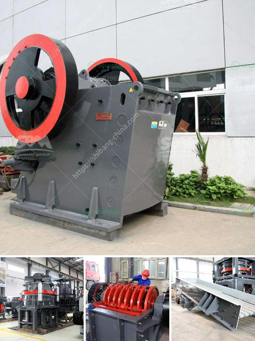

<h3>hammer mill for clay</h3>
The hammer mill is a machine that grinds down large particles of clay into a smaller, more efficient size. This tool is an essential part of many clay processing lines because it breaks down the clay lumps and removes any stones or impurities mixed in.

There are many types of hammer mills available, such as the large ones for construction sites, the middle-sized ones for ceramics factories, and the small ones for individuals to use at home. These different models cater to various needs and volumes of clay processing.

One of the main advantages of a hammer mill is its versatility. It can be used for a wide range of milling purposes, including shredding paper, rubber, and even food products. However, when used for clay processing, it is crucial to choose the right model that can withstand the demands of grinding tough clay materials.

The main components of a hammer mill for clay processing are the rotating shaft, the hammers, and the grate. These components take the clay material and break it apart by striking it with the rotating hammers. As the clay particles are hit by the hammers, they break down into smaller sizes and pass through the grate, which ensures that only the desired particle size moves forward, while larger pieces are recycled for further grinding.

The design of a hammer mill for clay processing is crucial to its efficiency and performance. The critical elements of a hammer mill are the rotor and the hammers, which rotate at high speeds to grind the clay material. The hammers are usually made of manganese steel, creating a high wear resistance that ensures longevity and reduced maintenance costs.

Clay is a naturally occurring material that varies in hardness and composition. Therefore, it is essential to choose a hammer mill that can handle the specific characteristics of the clay being processed. Some hammer mills are adjustable, allowing operators to control the desired size of the output particles. This flexibility is particularly useful when different clay products require different particle sizes.

In addition to size reduction, hammer mills also play a crucial role in clay cleaning. As the clay is fed into the mill, any impurities or stones mixed with the clay get broken down and separated. This cleaning process ensures a more consistent and higher-quality clay product.

In conclusion, a hammer mill is an essential machine in the clay processing line. It is a versatile tool that breaks down clay lumps and removes impurities, making it easier to turn clay into a consistent and high-quality material. Whether used in construction sites, ceramics factories, or even at home, the right hammer mill for clay processing can improve efficiency and maximize output.
<h3>Contact us</h3><ul><li><strong>Whatsapp:&nbsp;<a href="https://wa.me/8613661969651">+8613661969651</a></strong></li><li><a href="https://swt.shibang-china.com/?git&amp;zhl&amp;hammer mill for clay"><strong>Online Service(chat now)</strong></a></li></ul><h3>Related</h3><ul><li><a href='crusher plants for sale in pakistan.md'>crusher plants for sale in pakistan</a></li><li><a href='febcoal coal mining plant in ethiopia.md'>febcoal coal mining plant in ethiopia</a></li><li><a href='quartz powder special production line for mining.md'>quartz powder special production line for mining</a></li><li><a href='machines used stone crusher vancouver.md'>machines used stone crusher vancouver</a></li><li><a href='mica processing plant per ton.md'>mica processing plant per ton</a></li></ul>