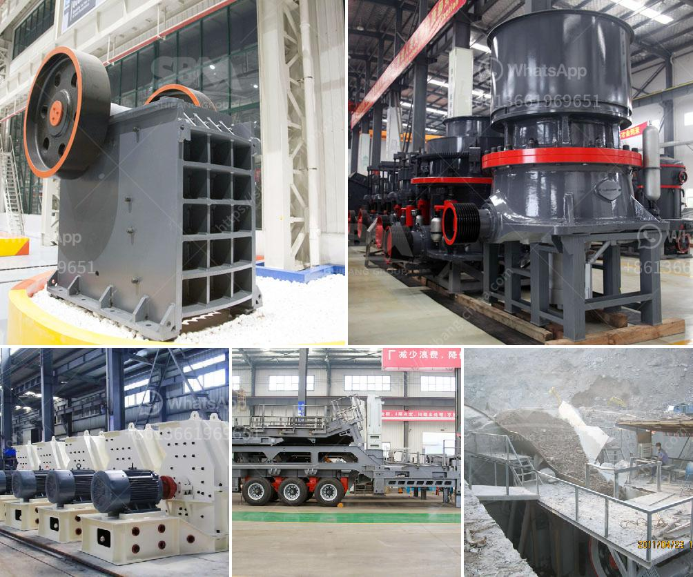

<h3>hammer mill for ldpe grinding</h3>
When it comes to size reduction in the plastics industry, one of the most commonly used machines is the hammer mill. Hammer mills are versatile machines that can be used for grinding, shredding, and pulverizing materials, such as LDPE (low-density polyethylene).

LDPE is a popular thermoplastic material that is mainly used for packaging applications. This lightweight, flexible material is commonly found in plastic bags, film products, and various types of containers. However, plastic waste generated from LDPE packaging materials poses a significant environmental challenge.

To address this issue, efficient LDPE grinding techniques are employed to process the waste into smaller particles, which can then be recycled and repurposed. The hammer mill is a crucial piece of equipment that plays a key role in this process. Let's explore its features, functionality, and benefits in more detail.

A hammer mill is a high-speed machine that uses rotating hammers or blades to impact, shear, and crush the material into fine particles. These machines are robust and built to handle a wide range of materials, such as LDPE, without causing excessive wear and tear. The hammers or blades are strategically positioned on a rotating shaft, which ensures consistent and efficient grinding.

1. Versatility: Hammer mills can handle a variety of materials and particle sizes, making them suitable for a wide range of applications. Whether you need coarse or fine grinding, a hammer mill can deliver the required particle size distribution efficiently.

2. Efficiency: Hammer mills are designed to maximize energy transfer from the motor to the grinding chamber, resulting in high grinding efficiency. This allows for faster processing and increased productivity.

3. Flexibility: Hammer mills can be configured with different screen sizes, allowing for precise control over the final particle size. This flexibility is especially important when processing LDPE, as different applications may require different particle sizes.

4. Cost-effectiveness: Hammer mills are relatively low-cost machines that offer high-performance grinding. They require minimal maintenance and have a long operational life, making them a cost-effective choice for LDPE grinding operations.

5. Size reduction uniformity: The design of the hammer mill ensures consistent size reduction, resulting in uniform particle size distribution. This uniformity is crucial for recycling LDPE, as it allows for better blending and processing of the recycled material.

In summary, hammer mills are highly efficient and versatile machines used for LDPE grinding in the plastics industry. Their ability to handle different materials and particle sizes, combined with their cost-effectiveness and high grinding efficiency, make them an ideal choice for size reduction operations. By using a hammer mill, plastic waste generated from LDPE packaging materials can be processed efficiently, contributing to a more sustainable and circular economy.
<h3>Contact us</h3><ul><li><strong>Whatsapp:&nbsp;<a href="https://wa.me/8613661969651">+8613661969651</a></strong></li><li><a href="https://swt.shibang-china.com/?git&amp;zhl&amp;hammer mill for ldpe grinding"><strong>Online Service(chat now)</strong></a></li></ul><h3>Related</h3><ul><li><a href='raymond mill vs ball mill.md'>raymond mill vs ball mill</a></li><li><a href='list of all the equipment for gold mining.md'>list of all the equipment for gold mining</a></li><li><a href='conveyor belt seller in korea.md'>conveyor belt seller in korea</a></li><li><a href='crushing sale rotary drum dryer cost.md'>crushing sale rotary drum dryer cost</a></li><li><a href='mobile screening and crushing.md'>mobile screening and crushing</a></li></ul>