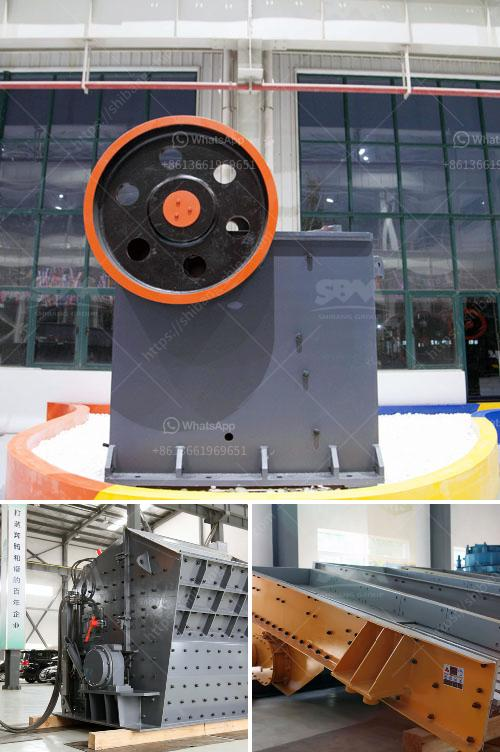

<h3>hammer mill for plants</h3>
The hammer mill is a valuable piece of equipment for any agricultural or horticultural enterprise, as it allows you to shred and crush plant material into smaller pieces. This new technology is changing the way farmers and gardeners are maintaining their fields and gardens, saving both time and energy.

One of the key benefits of the hammer mill is its versatility. Not only can it be used for grinding grains such as corn, wheat, and soybeans, but it can also be utilized for shredding yard and garden waste like trimmings and fallen leaves. By reducing plant material into smaller, more manageable pieces, it becomes easier to handle and dispose of, making it an ideal tool in waste management.

The hammer mill works by a series of rotating hammers attached to a shaft, which rotates at a high speed inside a chamber. The material to be shredded enters the chamber and is struck by the hammers, breaking it into smaller pieces. These pieces then pass through a screen, allowing the desired size to be collected.

By shredding plant material, the hammer mill assists in the decomposition process. Shredded organic matter breaks down faster, releasing nutrients into the soil. This can be particularly advantageous for composting or to improve soil health in garden beds and agricultural fields.

The hammer mill is also a cost-effective solution for farmers and gardeners who need to produce large quantities of animal feed. By grinding grains into smaller particles, it becomes easier for livestock to consume and digest the feed, resulting in improved overall performance.

In conclusion, the hammer mill is a valuable tool for any agricultural or horticultural enterprise. Its versatility and efficiency make it an essential piece of equipment for shredding and grinding plant material. Whether you need to process grains for animal feed or shred yard waste for composting, the hammer mill is an invaluable investment that will save you time and energy in the long run.
<h3>Contact us</h3><ul><li><strong>Whatsapp:&nbsp;<a href="https://wa.me/8613661969651">+8613661969651</a></strong></li><li><a href="https://swt.shibang-china.com/?git&amp;zhl&amp;hammer mill for plants"><strong>Online Service(chat now)</strong></a></li></ul><h3>Related</h3><ul><li><a href='primary crusher price in bolivia.md'>primary crusher price in bolivia</a></li><li><a href='used gold mining equipment for sale in south africa.md'>used gold mining equipment for sale in south africa</a></li><li><a href='crusher plant for sale in mardan.md'>crusher plant for sale in mardan</a></li><li><a href='coal mining equipment in spain.md'>coal mining equipment in spain</a></li><li><a href='concrete crushing machines.md'>concrete crushing machines</a></li></ul>