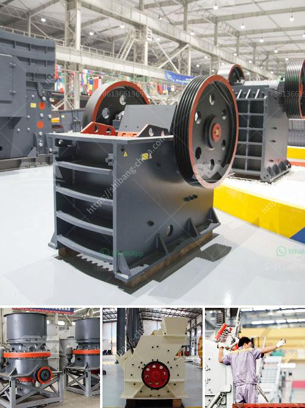

<h3>hammer mill sales kenya</h3>
Hammer mill sales in Kenya have been growing steadily over the past few years. With the increasing demand for locally sourced materials used in the production of animal feed, this machine is playing a crucial role in meeting that demand.

A hammer mill is a machine that crushes materials into small particles through a series of rotating hammers. This device is popularly used by farmers and small-scale businesses in Kenya to process maize, wheat, and other grains, making it suitable for producing animal feed.

One of the reasons why hammer mills are in high demand in Kenya is because they provide efficient and cost-effective solutions for small-scale farmers. Instead of relying on manual labor or purchasing expensive milling equipment, farmers can easily grind their own grains using a hammer mill, saving both time and money. Moreover, the machine's compact size makes it suitable for use in small spaces, making it ideal for Kenya's rural farming communities.

Additionally, the availability of different hammer mill sizes and capacities caters to the varying needs of farmers. Depending on the specific requirements, farmers can choose the machine that best suits their production volume. This versatility has contributed to the widespread adoption of hammer mills in the country.

Furthermore, the growth in the sale of hammer mills in Kenya can be attributed to the rising awareness of the importance of animal feed quality in livestock production. Farmers are now recognizing that homemade animal feed, made with the help of a hammer mill, ensures a balanced and nutritious diet for their livestock. Consequently, the demand for hammer mills has surged as farmers strive to enhance the health and productivity of their animals.

In conclusion, the sales of hammer mills in Kenya have witnessed a significant increase, driven by the need for locally sourced animal feed materials. The machine's affordability, compact size, and versatility have made it a popular choice among small-scale farmers in the country. As the demand for high-quality animal feed continues to rise, the hammer mill industry in Kenya is expected to grow even further.
<h3>Contact us</h3><ul><li><strong>Whatsapp:&nbsp;<a href="https://wa.me/8613661969651">+8613661969651</a></strong></li><li><a href="https://swt.shibang-china.com/?git&amp;zhl&amp;hammer mill sales kenya"><strong>Online Service(chat now)</strong></a></li></ul><h3>Related</h3><ul><li><a href='stone crusher machine for sale kenya.md'>stone crusher machine for sale kenya</a></li><li><a href='sand and gravel separator machine for sale philippines.md'>sand and gravel separator machine for sale philippines</a></li><li><a href='jaw crusher size specifications.md'>jaw crusher size specifications</a></li><li><a href='ball mill in zimbabwe for sale.md'>ball mill in zimbabwe for sale</a></li><li><a href='rotary crusher manufacturer.md'>rotary crusher manufacturer</a></li></ul>