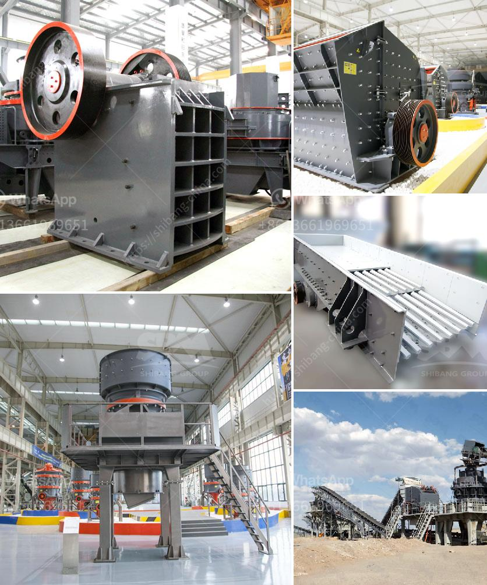

<h3>hammer mill sizes</h3>
In the world of mechanical processing and size reduction, there are numerous methods to achieve the desired particle size. One popular choice is the hammer mill, a versatile and efficient machine that is used across many industries. However, with a variety of sizes available, it is crucial to find the right hammer mill size for your specific application.

Hammer mills are designed to crush or pulverize solid materials into smaller pieces. They consist of a rotating shaft fitted with hammers that strike the material and break it into pieces. The size of the final product depends on the size of the screen perforations and the speed of the hammer mill.

Choosing the correct hammer mill size is essential to ensure that you achieve the desired particle size, while also optimizing efficiency and throughput. Here are a few factors to consider in selecting the right size:

1. Material Characteristics: The nature of the material being processed greatly influences the selection of hammer mill size. Factors such as hardness, moisture content, density, and friability will determine the energy required for size reduction. Softer materials can be processed in smaller hammer mills, while harder or denser materials may need a larger size.

2. Desired Particle Size: The size of the final product you require will also determine the appropriate hammer mill size. Finer particle sizes will require smaller screen perforations and higher hammer tip speeds. Coarser particle sizes, on the other hand, will require larger screen perforations and lower hammer tip speeds. By understanding the particle size distribution you need, you can select an appropriate hammer mill size that can achieve your desired outcome.

3. Capacity and Throughput: Another critical consideration is the desired processing capacity. Hammer mills are available in various sizes, catering to different processing capacities. A larger hammer mill will typically have higher throughput capabilities, ensuring that you can process larger volumes in a shorter time. Conversely, if you have lower production requirements, a smaller hammer mill may be more suitable.

4. Space Constraints: The available space in your facility can influence the hammer mill size. It is important to take into account the overall dimensions of the machine, including the required clearance for operation, maintenance, and safety. Ensure that you have adequate space to accommodate the hammer mill without causing any operational hindrances.

5. Energy Consumption: The efficiency of a hammer mill is influenced by its size. Smaller mills generally require less power to operate, making them more energy-efficient. However, larger mills often offer economies of scale as they can process materials quicker and more efficiently. Carefully weigh the trade-offs between size, energy consumption, and overall operating costs to select the most suitable option.

Regardless of the size you choose, hammer mills offer numerous advantages, including versatility, ease of operation, and low maintenance requirements. They are commonly used in industries such as agriculture, food processing, pharmaceuticals, and mining, among others.

In conclusion, selecting the right hammer mill size is crucial for achieving the desired particle size, optimizing efficiency, and maximizing throughput. Consider the material characteristics, desired particle size, capacity requirements, space constraints, and energy consumption to make an informed decision. Consulting with experts in the field can also provide valuable insights in determining the ideal hammer mill size for your application.
<h3>Contact us</h3><ul><li><strong>Whatsapp:&nbsp;<a href="https://wa.me/8613661969651">+8613661969651</a></strong></li><li><a href="https://swt.shibang-china.com/?git&amp;zhl&amp;hammer mill sizes"><strong>Online Service(chat now)</strong></a></li></ul><h3>Related</h3><ul><li><a href='jaw crusher in dar es salaam.md'>jaw crusher in dar es salaam</a></li><li><a href='stone crusher in jos plateau state nigeria.md'>stone crusher in jos plateau state nigeria</a></li><li><a href='crusher for sale in pakistan.md'>crusher for sale in pakistan</a></li><li><a href='metal conveyor belts in plates.md'>metal conveyor belts in plates</a></li><li><a href='schredder and grinding mille for sale.md'>schredder and grinding mille for sale</a></li></ul>