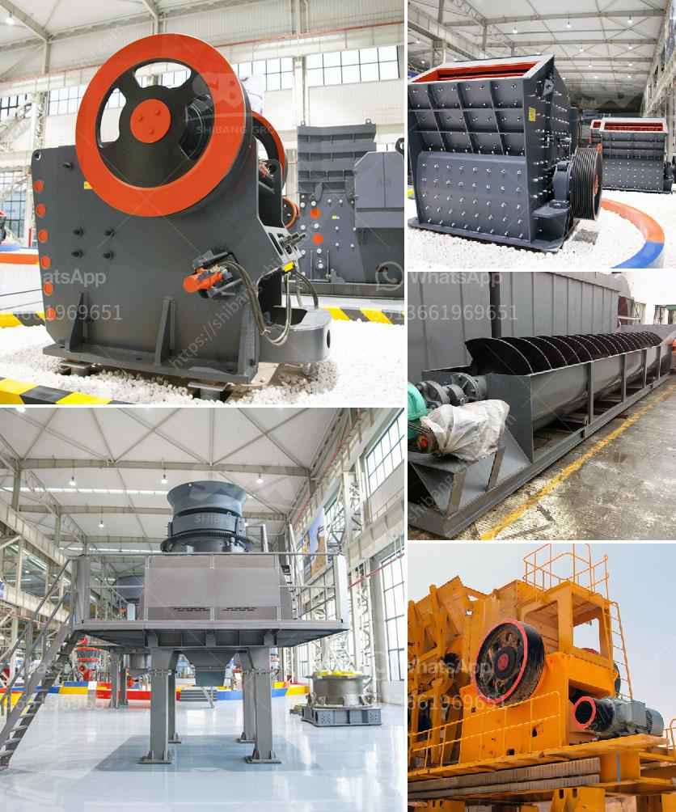

<h3>hammer mills for limestone</h3>
Limestone is a sedimentary rock with a wide range of applications. It is commonly used in construction, agriculture, and industrial processes. As the demand for limestone grows, hammer mills are becoming an increasingly popular choice in the size reduction industry.

Hammer mills are rugged machines that crush material by impact alone. They are capable of grinding a wide range of materials, including limestone, into various particle sizes. With the wide range of applications, sizes, and designs of hammer mills, they can efficiently and effectively process materials with varying moisture levels and viscosity.

The hammer mill's design allows for a large variety of rotor configurations to suit different applications. It is useful in processing the mineral ores like limestone, as it combines crushing, grinding, and classifying process in a single machine. It incorporates a grate basket at the top, which helps to break the feed into smaller particles and segregate the larger particles for further grinding.

One of the significant advantages of using hammer mills is their ability to produce a wide range of particle sizes. This allows the end-users to control the desired product's size more precisely, thereby enhancing product quality. Hammer mills are also capable of producing finer particles than roller mills. As a result, they work well for limestone grinding applications.

As an essential component of the size reduction process, the hammer mill plays a critical role in the overall efficiency of the entire limestone processing chain. Hammer mills consist of a series of hammers (usually four or more) hinged on a central shaft and enclosed within a rigid metal case. It produces size reduction by impact. The materials to be milled are struck by these rectangular pieces of hardened steel (ganged hammer) that rotate at high speed inside the milling chamber. The hammers impact the feed material, breaking it into smaller particles.

The hammer mill has a reliable and sturdy design, which enables it to break down even the most abrasive and challenging materials. Once the material has been reduced to the desired size, it exits through a sizing screen, which regulates the product's particle size. The hammer mills are generally capable of delivering a high-quality product, with a uniform particle distribution and excellent grinding efficiency.

In addition to their robustness and reliability, hammer mills for limestone are incredibly versatile. They can produce a range of particle sizes suitable for different purposes, including coarse aggregates for concrete, bedding materials, and agricultural lime for soil enrichment. Hammer mills for limestone also offer the advantage of being faster than roller mills, as they can process inputs at a higher throughput rate.

In conclusion, hammer mills for limestone are designed to produce a consistent and precise particle size by crushing, grinding, and classifying the material. They are available in various designs, sizes, and shapes to suit different applications. Due to their versatility, high grinding efficiency, and long-term reliability, they have become a staple in the limestone processing industry. Whether used in construction, agriculture, or industrial processes, hammer mills offer a practical solution for efficiently processing limestone into various particle sizes.
<h3>Contact us</h3><ul><li><strong>Whatsapp:&nbsp;<a href="https://wa.me/8613661969651">+8613661969651</a></strong></li><li><a href="https://swt.shibang-china.com/?git&amp;zhl&amp;hammer mills for limestone"><strong>Online Service(chat now)</strong></a></li></ul><h3>Related</h3><ul><li><a href='jaw stone crusher for excavators.md'>jaw stone crusher for excavators</a></li><li><a href='stone hammer mill.md'>stone hammer mill</a></li><li><a href='cotizacion de equipos mineros.md'>cotizacion de equipos mineros</a></li><li><a href='crusher plant for sale in mardan.md'>crusher plant for sale in mardan</a></li><li><a href='used crusher equipment south africa.md'>used crusher equipment south africa</a></li></ul>