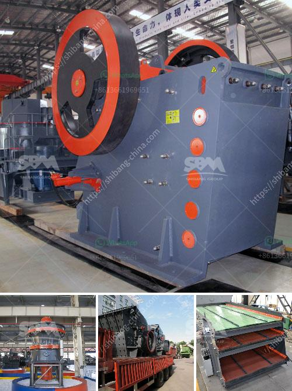

<h3>hammer mills for sale at saro zambia</h3>
Hammer mills are versatile machines used for grinding, crushing, and pulverizing solid materials into smaller pieces. This equipment is widely used in a variety of industries, including farming, milling, grain processing, and waste management. In Zambia, there are several manufacturers and suppliers of hammer mills for sale at Saro Zambia.

Saro Agro Industrial Ltd is one of the leading agricultural machinery suppliers in Zambia, providing a wide range of equipment for the farming and rural sector. The company offers a comprehensive selection of hammer mills for sale, ensuring that they meet the market and financial needs of their customers. These mills are designed to grind and crush different types of materials, such as grains, rocks, and biomass.

One of the main advantages of using a hammer mill is its ability to produce a wide range of particle sizes. This results from the hammer mill's ability to control the size of the product by adjusting the speed and hammer configuration. Different screen sizes can be placed in the machine to achieve the desired particle size, making it suitable for various applications. For example, a fine grind is needed for poultry feed, while a coarse grind may be required for animal bedding.

In addition to the adjustable particle size, hammer mills are also known for their high efficiency and low energy consumption. The design of the hammers and the screen ensures that the grinding process is efficient, reducing the amount of material wasted and maximizing the output. This makes hammer mills an economical choice for farmers and entrepreneurs looking to process large quantities of materials.

Saro Zambia offers a variety of hammer mills for sale, providing options for both small and large-scale producers. They have different models with varying capacities and power requirements. Customers can choose the most suitable model based on their specific needs and budget. The team at Saro Zambia is also dedicated to providing excellent after-sales support, including maintenance and spare parts availability, ensuring that customers can rely on their equipment for years to come.

Furthermore, Saro Zambia's hammer mills are built with durability in mind. The materials used in their construction are of high quality, ensuring that the machines can withstand the demands of heavy-duty usage. This is especially important in Zambia, where farming and agricultural activities are often carried out in challenging conditions.

In conclusion, hammer mills for sale at Saro Zambia are versatile, efficient, and durable machinery used for grinding and crushing a variety of materials. With their wide range of applications, they are an essential investment for farmers, millers, and entrepreneurs looking to process materials efficiently and economically. Saro Zambia's commitment to providing high-quality equipment and excellent after-sales support makes them a trusted supplier in the Zambian agricultural industry.
<h3>Contact us</h3><ul><li><strong>Whatsapp:&nbsp;<a href="https://wa.me/8613661969651">+8613661969651</a></strong></li><li><a href="https://swt.shibang-china.com/?git&amp;zhl&amp;hammer mills for sale at saro zambia"><strong>Online Service(chat now)</strong></a></li></ul><h3>Related</h3><ul><li><a href='screening plant for hire south africa.md'>screening plant for hire south africa</a></li><li><a href='manufacture of conveyor belts in mexico.md'>manufacture of conveyor belts in mexico</a></li><li><a href='components of a limestone primary plant.md'>components of a limestone primary plant</a></li><li><a href='iron ore mines equipments.md'>iron ore mines equipments</a></li><li><a href='about aggregate crusher plants.md'>about aggregate crusher plants</a></li></ul>