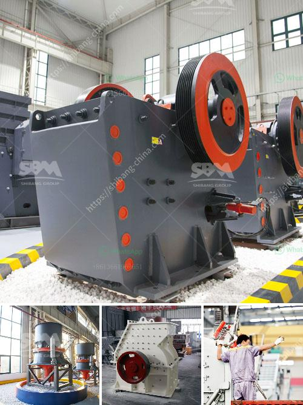

<h3>hammer mills in harare zimbabwe</h3>
Hammer mills are a versatile and essential machines in the agricultural industry. These machines are used to grind grains or other raw materials into the desired size for livestock feed and manufacturing purposes. These mills are prevalent in Harare, Zimbabwe as the staple food for most households in the area is mealie meal, a finely ground maize product.

In Harare, hammer mills are primarily used for grinding maize, which is made into mealie meal. The mealie meal is then used to make sadza, a traditional staple food in Zimbabwe. Sadza is essentially a thick porridge made from the mealie meal, which is enjoyed with various meat and vegetable dishes.

The hammer mills in Harare are particularly popular with small-scale millers and farmers. These individuals often own small plots of land and rely on milling their own maize to produce mealie meal for their families or sell to the local community. The hammer mills provide an efficient and cost-effective way for these individuals to produce the desired maize product.

Moreover, hammer mills in Harare are also utilized by larger-scale milling companies to process and crush various agricultural products, such as maize, sunflower seeds, and sorghum. These companies provide a vital service to the farming community by offering milling services at affordable rates. The availability of hammer mills ensures that farmers have easy access to the necessary equipment to transform raw materials into marketable products.

In conclusion, hammer mills play a crucial role in Harare, Zimbabwe, where maize is a staple food. These machines are used by both small-scale millers and larger-scale milling companies to produce mealie meal and other agricultural products. With their efficiency and affordability, hammer mills have become indispensable in the agricultural industry, ensuring the availability of quality food for the community.
<h3>Contact us</h3><ul><li><strong>Whatsapp:&nbsp;<a href="https://wa.me/8613661969651">+8613661969651</a></strong></li><li><a href="https://swt.shibang-china.com/?git&amp;zhl&amp;hammer mills in harare zimbabwe"><strong>Online Service(chat now)</strong></a></li></ul><h3>Related</h3><ul><li><a href='rotary crusher manufacturer.md'>rotary crusher manufacturer</a></li><li><a href='south africa mobile rock crusher.md'>south africa mobile rock crusher</a></li><li><a href='impact crusher in egypt.md'>impact crusher in egypt</a></li><li><a href='crusher and screening plants for sale.md'>crusher and screening plants for sale</a></li><li><a href='ball mill suppliers for lead processing.md'>ball mill suppliers for lead processing</a></li></ul>