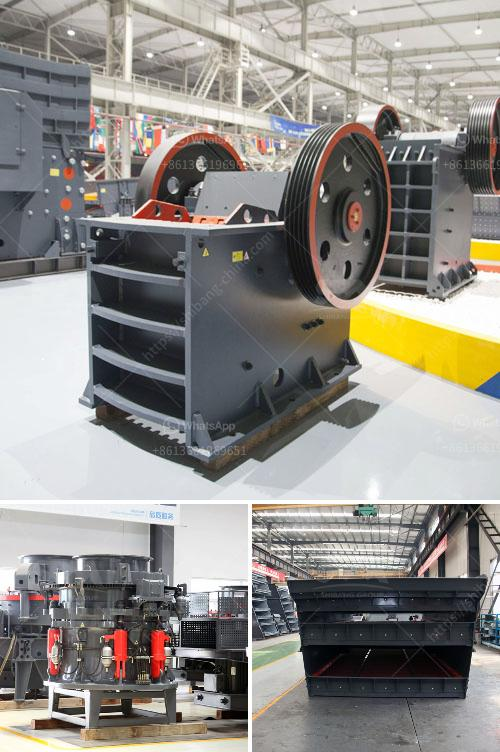

<h3>hard rock crusher</h3>
The Hard Rock Crusher, designed by our company, is an innovative and technologically advanced crusher that improves efficiency and saves energy. Its unique features and robust design make it capable of crushing various types of raw materials, including hard rocks and ores, efficiently and precisely.

One of the key benefits of the Hard Rock Crusher is its ability to crush rocks of various sizes and hardness levels. This makes it ideal for different applications, including mining, construction, and highway engineering. Whether it is limestone, granite, or basalt, this crusher can handle it all.

The advanced technology incorporated in the Hard Rock Crusher ensures high productivity and reduced operating costs. With its optimized crushing chamber and large throw, it delivers higher crushing capacity and quality end products. Moreover, the hydraulic system provides over-load protection and easy adjustment of the crusher settings to achieve the desired output size.

The Hard Rock Crusher is also equipped with high-quality and durable wear parts, ensuring extended service life and reduced maintenance. The unique design of the crushing chamber facilitates easy access for inspections and replacement of worn-out components, minimizing downtime and increasing efficiency.

Furthermore, the Hard Rock Crusher is equipped with a reliable and efficient motor, ensuring smooth and reliable operation. Its noise and vibration levels are significantly reduced, making it an environmentally friendly and operator-friendly machine.

In conclusion, the Hard Rock Crusher is a game-changer in the industry. Its innovative design, robust construction, and advanced technology make it a reliable and efficient solution for crushing hard rocks and ores. With its high productivity, low operating costs, and reduced downtime, it is a valuable addition to any mining or construction operation.
<h3>Contact us</h3><ul><li><strong>Whatsapp:&nbsp;<a href="https://wa.me/8613661969651">+8613661969651</a></strong></li><li><a href="https://swt.shibang-china.com/?git&amp;zhl&amp;hard rock crusher"><strong>Online Service(chat now)</strong></a></li></ul><h3>Related</h3><ul><li><a href='singapore handheld concrete crusher.md'>singapore handheld concrete crusher</a></li><li><a href='difference between raymond mill and vertical roller mill.md'>difference between raymond mill and vertical roller mill</a></li><li><a href='raymond mill production line.md'>raymond mill production line</a></li><li><a href='mobile crusher machine in iran.md'>mobile crusher machine in iran</a></li><li><a href='used quarry crusher for sale.md'>used quarry crusher for sale</a></li></ul>