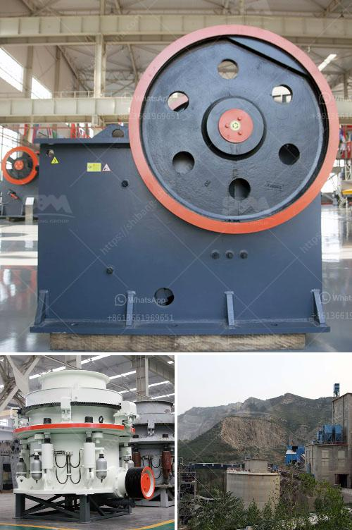

<h3>hard rock ultrafine grinder in canada</h3>
Canada, known for its rich geological resources, is a leading producer and exporter of minerals worldwide. From gold and silver to iron ore and copper, Canada's mining industry plays a vital role in the country's economic growth. To extract and process these valuable resources, the mining sector heavily relies on equipment such as grinders, crushers, and pulverizers. One such innovation that has been gaining significant attention in recent years is the hard rock ultrafine grinder.

Traditional grinding methods have long been used in the mining industry to reduce large rocks into smaller particles. However, these conventional grinders have several limitations, including inefficiency, energy consumption, and limited particle size distribution. In response to these challenges, the hard rock ultrafine grinder has emerged as a game-changer for mineral processing in Canada.

The hard rock ultrafine grinder is a specialized equipment designed for the grinding of hard and abrasive materials, including those commonly found in the Canadian mining industry. Its main advantage lies in its ability to grind ore particles to ultrafine sizes, significantly smaller than those achieved by conventional grinders. This ultrafine grinding technology not only improves mineral liberation but also enhances the overall recovery rates of valuable minerals.

One of the key features of the hard rock ultrafine grinder is its high-speed rotor, which provides intense impact and friction forces to break down the material. This unique design allows the grinder to achieve a higher energy efficiency compared to traditional grinding methods. As a result, it reduces energy consumption and subsequently lowers operational costs for mining companies in Canada.

The ultrafine grinder's ability to produce ultrafine particles also makes it suitable for recovering valuable minerals that were previously considered uneconomical due to their small particle size. This opens up new opportunities for Canadian mining companies to extract and profit from previously untapped resources. By maximizing the recovery rates of both large and small particles, the ultrafine grinder contributes to the sustainability and long-term profitability of the mining industry in Canada.

Furthermore, the hard rock ultrafine grinder's particle size distribution is highly controllable. This allows the mining operators to tailor the grinding process according to the specific needs of their ore, resulting in higher product quality and consistency. With its versatility and precision, the ultrafine grinder can efficiently process various mineral ores and non-metallic minerals, providing a competitive edge for Canadian mining operations.

In conclusion, the hard rock ultrafine grinder is revolutionizing mineral grinding in Canada. Its ability to produce ultrafine particles, improve mineral liberation, and enhance recovery rates make it an indispensable tool for the mining sector. By utilizing this advanced technology, Canadian mining companies can optimize their operations, reduce costs, and increase their overall productivity. As the demand for minerals continues to grow, the hard rock ultrafine grinder is poised to play a pivotal role in driving the future success of the Canadian mining industry.
<h3>Contact us</h3><ul><li><strong>Whatsapp:&nbsp;<a href="https://wa.me/8613661969651">+8613661969651</a></strong></li><li><a href="https://swt.shibang-china.com/?git&amp;zhl&amp;hard rock ultrafine grinder in canada"><strong>Online Service(chat now)</strong></a></li></ul><h3>Related</h3><ul><li><a href='talc grinding machine manufacturer from uzbekistan.md'>talc grinding machine manufacturer from uzbekistan</a></li><li><a href='components of a limestone primary plant.md'>components of a limestone primary plant</a></li><li><a href='mobile crushing machine manufacturer.md'>mobile crushing machine manufacturer</a></li><li><a href='marble and granite grinder and crusher.md'>marble and granite grinder and crusher</a></li><li><a href='stone crusher machine for sale tanzania.md'>stone crusher machine for sale tanzania</a></li></ul>