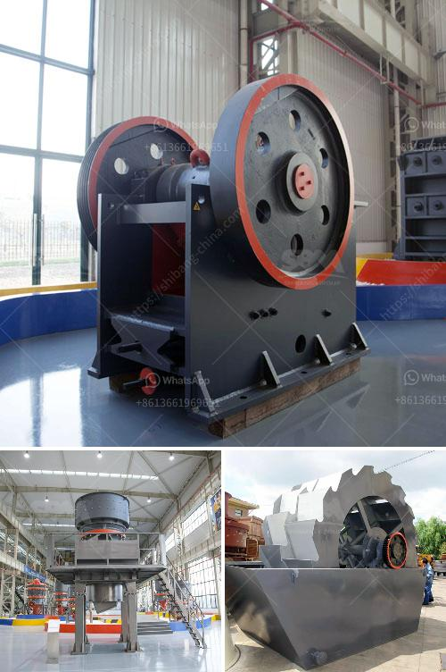

<h3>high efficiency separator for raw material ball mill</h3>
A high-efficiency separator for raw material ball mill is crucial for grinding processes in the cement industry. In recent years, there has been a gradual shift towards this type of equipment as it presents significant advantages over the conventional separators.

One of the main advantages is its ability to achieve a higher efficiency of separation compared to the older generation separators. The high-efficiency separator allows for the fine grinding of raw materials, enabling better control of the grind size and ultimately leading to a more uniform and higher-quality cement product. This leads to improved performance in terms of strength, durability, and overall consistency.

Furthermore, the high-efficiency separator helps to reduce energy consumption in the grinding process. By properly classifying the raw materials in the mill, the energy required to achieve the desired fineness is significantly reduced. This not only leads to cost savings but also promotes sustainability by minimizing the carbon footprint.

Another important feature of the high-efficiency separator is its ability to handle variable feed materials. Different raw materials have different grindability and particle size distribution, and the separator can adapt accordingly. This flexibility allows for optimal grinding conditions for various types of raw materials, ensuring stable and efficient operation.

Maintenance requirements are also reduced with the high-efficiency separator. The design and construction of these separators incorporate features that minimize wear and tear, resulting in longer service life and reduced downtime. This translates to enhanced productivity and cost savings for the cement plant.

In conclusion, a high-efficiency separator for raw material ball mill is essential for the effective and efficient grinding of raw materials in the cement industry. This equipment presents numerous benefits, including higher separation efficiency, reduced energy consumption, and improved product quality. Investing in a high-quality separator can significantly enhance the overall performance and sustainability of a cement plant.
<h3>Contact us</h3><ul><li><strong>Whatsapp:&nbsp;<a href="https://wa.me/8613661969651">+8613661969651</a></strong></li><li><a href="https://swt.shibang-china.com/?git&amp;zhl&amp;high efficiency separator for raw material ball mill"><strong>Online Service(chat now)</strong></a></li></ul><h3>Related</h3><ul><li><a href='cement mill motor for sale uk.md'>cement mill motor for sale uk</a></li><li><a href='complete stone quarry plant.md'>complete stone quarry plant</a></li><li><a href='5 ton per hour mobile gold process mill.md'>5 ton per hour mobile gold process mill</a></li><li><a href='slag processing plant in india.md'>slag processing plant in india</a></li><li><a href='450 tph limestone crusher.md'>450 tph limestone crusher</a></li></ul>