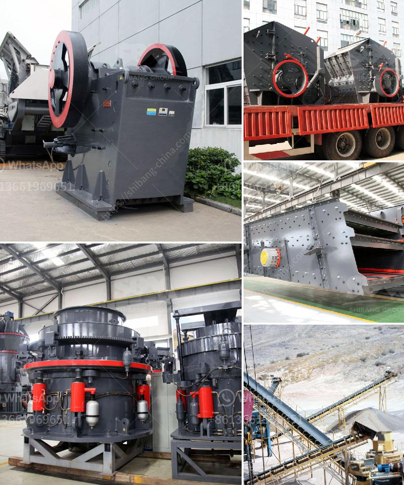

<h3>how different impact crusher and hammer mill</h3>
When it comes to crushing equipment, hammer mills and impact crushers are two commonly used devices of comminution. However, experience tells us that there are some noteworthy differences between the two types of machinery which should be taken into consideration when choosing the right equipment for your application. This article aims to discuss the distinct features of impact crushers and hammer mills to help you make an informed decision.

Firstly, let's start by understanding the basic principles behind each machine. An impact crusher utilizes the force of impact to pulverize soft or non-abrasive mining ores and rocks, whereas a hammer mill uses the principle of attrition to crush materials through a grinding mechanism. Both machines are characterized by their high productivity, reduced operating costs, and ease of maintenance. 

When it comes to size reduction, the impact crusher is renowned for its versatility and can be used in a variety of applications. Its primary functions include both primary and secondary crushing in the mining, construction, and recycling industries. The impact crusher utilizes the principle of impact acceleration to break particles upon impact. The rotor assembly revolves at high speeds, generating kinetic energy that is transferred to the material being crushed. This impact causes the material to break into smaller pieces that are discharged through the curtain liners.

On the other hand, the hammer mill is primarily used for coarse crushing or grinding operations that require high reduction ratios. In this equipment, the material is fed into a chamber equipped with a rotating hammer mechanism. The high-speed rotating hammers serve to break the material by applying force along its surface. The material is progressively reduced in size and discharged through a screen or perforated grate at the bottom of the machine.

One of the key differences between impact crushers and hammer mills lies in the way they achieve their size reduction potential. While hammer mills rely on energy from impact, crushers utilize pressure and shear forces to accomplish the desired reduction. This mechanical difference in the machinery is what sets them apart.

Furthermore, the design and construction of the impact crusher and hammer mill also determine their respective applications and advantages. For example, impact crushers have a durable rotor capable of withstanding high impact forces and are generally more suitable for processing materials with low abrasive properties. Conversely, hammer mills feature sturdy construction and large feed openings, making them particularly suitable for processing materials with high abrasiveness.

In conclusion, both impact crushers and hammer mills are effective crushing machines that have different mechanisms for breaking down materials. Selecting the right equipment boils down to understanding the specific requirements of your application. If you need versatile machinery suitable for various applications such as primary and secondary crushing, an impact crusher might be the right choice. However, if you require coarse crushing or grinding operations, a hammer mill might be a better option. Ultimately, your decision should be based on factors such as the material properties, desired final product size, and maintenance requirements.
<h3>Contact us</h3><ul><li><strong>Whatsapp:&nbsp;<a href="https://wa.me/8613661969651">+8613661969651</a></strong></li><li><a href="https://swt.shibang-china.com/?git&amp;zhl&amp;how different impact crusher and hammer mill"><strong>Online Service(chat now)</strong></a></li></ul><h3>Related</h3><ul><li><a href='used concrete mixer for sale dubai.md'>used concrete mixer for sale dubai</a></li><li><a href='italia dry production line supplier.md'>italia dry production line supplier</a></li><li><a href='used stone crusher plant for sale andhra pradesh.md'>used stone crusher plant for sale andhra pradesh</a></li><li><a href='diatomaceous earth processing machinery.md'>diatomaceous earth processing machinery</a></li><li><a href='stone crushing plant electro plants.md'>stone crushing plant electro plants</a></li></ul>