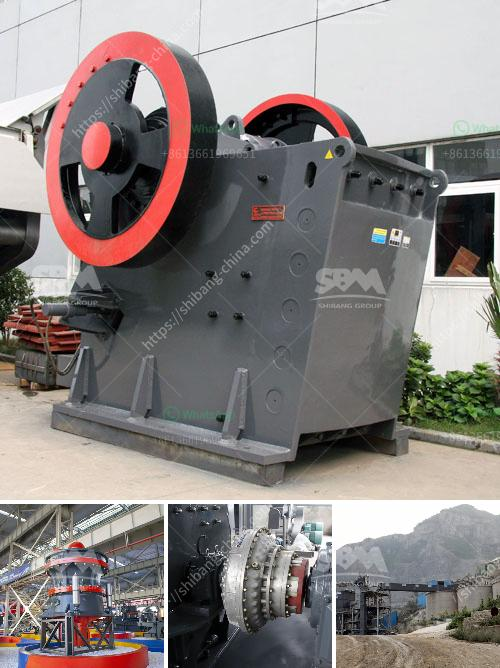

<h3>how does a quarry operate complete crushing palnt</h3>
A quarry is a site where various types of rocks, stones, and minerals are extracted from the Earth’s crust. This process involves drilling, blasting, and crushing of the rock to obtain usable stone and minerals. A complete crushing plant typically consists of primary, secondary, and tertiary crushers, as well as several feeders and screens to facilitate the crushing process. The primary crusher is usually a jaw crusher, while the secondary and tertiary crushers are typically cone crushers.

The primary crusher breaks down the rock into a manageable size, which is then fed into the secondary crusher. This crusher further reduces the size of the material before passing it through a series of screens. The screens help separate the crushed stones into different sizes, depending on the intended use. The larger stones will go through the tertiary crusher for further reduction, while the smaller stones will be used as base materials or aggregate.

To operate efficiently, the complete crushing plant requires regular maintenance and preventive measures. The crushers’ moving parts, such as the bearings and belts, should be inspected regularly to ensure proper functioning. Additionally, routine cleaning and lubrication are necessary to prevent build-up of dust and debris, which can reduce the plant’s performance and lifespan.

The size of the quarry determines the scale of the crushing plant. A small quarry may be relatively simple in its operation, requiring only basic machinery to process the materials. However, a large quarry with extensive resources may have a more complex setup, including multiple crushers, screens, and conveyors. These components work together to efficiently process a larger amount of material.

One crucial factor in a quarry’s operation is the source of material. It is essential to identify suitable rock deposits that can sustain the quarry’s operation over an extended period. Geological surveys and assessments are undertaken to determine the quality and quantity of the rock present in the area. Sustainable quarrying practices involve responsible extraction and rehabilitation of the land once the resources are depleted.

Safety is of utmost importance in a quarry’s operation. Quarry workers are equipped with proper safety gear and are trained to comply with safety regulations and practices. Dust control measures are implemented to mitigate the risks associated with airborne dust particles.

In conclusion, a quarry operates by extracting rocks, stones, and minerals from the Earth’s crust through drilling, blasting, and crushing processes. The complete crushing plant plays a crucial role in this operation, breaking down the extracted material into various sizes for different purposes. Regular maintenance and safety measures are essential for the efficient and safe operation of the quarry. By adhering to sustainable practices, quarries can ensure that their operations are environmentally responsible and contribute to the local economy.
<h3>Contact us</h3><ul><li><strong>Whatsapp:&nbsp;<a href="https://wa.me/8613661969651">+8613661969651</a></strong></li><li><a href="https://swt.shibang-china.com/?git&amp;zhl&amp;how does a quarry operate complete crushing palnt"><strong>Online Service(chat now)</strong></a></li></ul><h3>Related</h3><ul><li><a href='tpd cement grinding plant cost and project report.md'>tpd cement grinding plant cost and project report</a></li><li><a href='jaw crusher baxter.md'>jaw crusher baxter</a></li><li><a href='bauxite crusher equipment.md'>bauxite crusher equipment</a></li><li><a href='dealers of mobile jaw crusher in kenya.md'>dealers of mobile jaw crusher in kenya</a></li><li><a href='ball mill zenit crusher china.md'>ball mill zenit crusher china</a></li></ul>