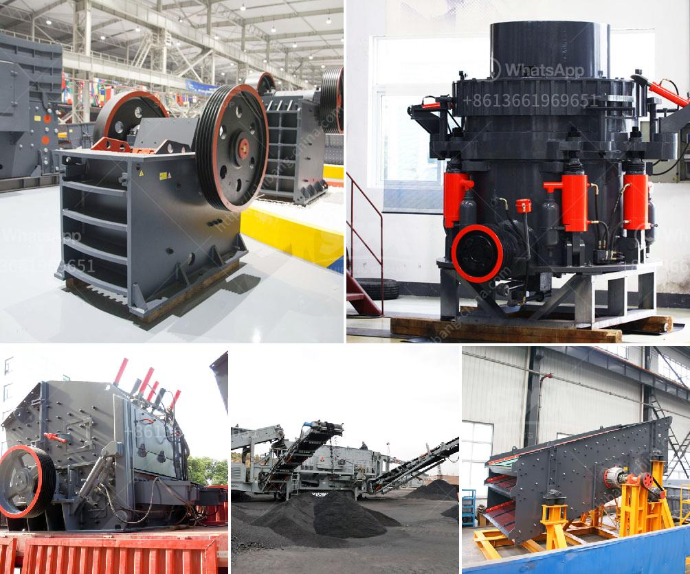

<h3>how is granite mined and processed</h3>
Granite is an igneous rock that is widely used in construction, primarily as a building material for countertops and flooring. Its durability, beautiful appearance, and range of colors make it a popular choice for both residential and commercial projects. But have you ever wondered how this stunning stone is mined and processed?

The process of mining granite begins with prospecting. This involves identifying potential sites for granite deposits through geological surveys and satellite imagery. Once a site is located, the extraction process begins.

The first step in mining granite is to remove the overlying soil and vegetation using heavy machinery or explosives if necessary. The granite deposit is then accessed by creating a series of vertically oriented cuts, known as benches, into the quarry wall. These benches allow workers to extract granite in large blocks.

After the initial extraction, diamond wire saws are used to cut the granite blocks into smaller, manageable sizes. These blocks can weigh several tons each and require the use of heavy equipment for handling. The blocks are then transported to a processing facility.

At the processing facility, the granite blocks are sawn into slabs using large industrial saws equipped with diamond-tipped blades. These slabs are typically about 2-3 cm thick and can vary in size depending on the customer's requirements.

Once the slabs are cut, they undergo a process called polishing, which enhances their natural shine and smoothness. This is achieved by rubbing the slabs with specialized polishing pads and abrasive compounds.

The final step in processing granite involves inspecting the slabs for quality control and packaging them for shipping. The slabs are carefully examined for any defects or imperfections, ensuring that only the highest quality pieces are sent to customers.

In conclusion, the mining and processing of granite is a complex and labor-intensive process that requires specialized equipment and expertise. From prospecting and extraction to cutting, polishing, and quality control, every step is carefully executed to ensure the production of stunning granite products. So, the next time you admire a granite countertop or flooring, you can appreciate the intricate journey it took from the quarry to your home.
<h3>Contact us</h3><ul><li><strong>Whatsapp:&nbsp;<a href="https://wa.me/8613661969651">+8613661969651</a></strong></li><li><a href="https://swt.shibang-china.com/?git&amp;zhl&amp;how is granite mined and processed"><strong>Online Service(chat now)</strong></a></li></ul><h3>Related</h3><ul><li><a href='nigeria raymond mill.md'>nigeria raymond mill</a></li><li><a href='cotizacion de equipos mineros.md'>cotizacion de equipos mineros</a></li><li><a href='hammer mills in harare zimbabwe.md'>hammer mills in harare zimbabwe</a></li><li><a href='price of mobile stone crusher.md'>price of mobile stone crusher</a></li><li><a href='steel hammer mill.md'>steel hammer mill</a></li></ul>