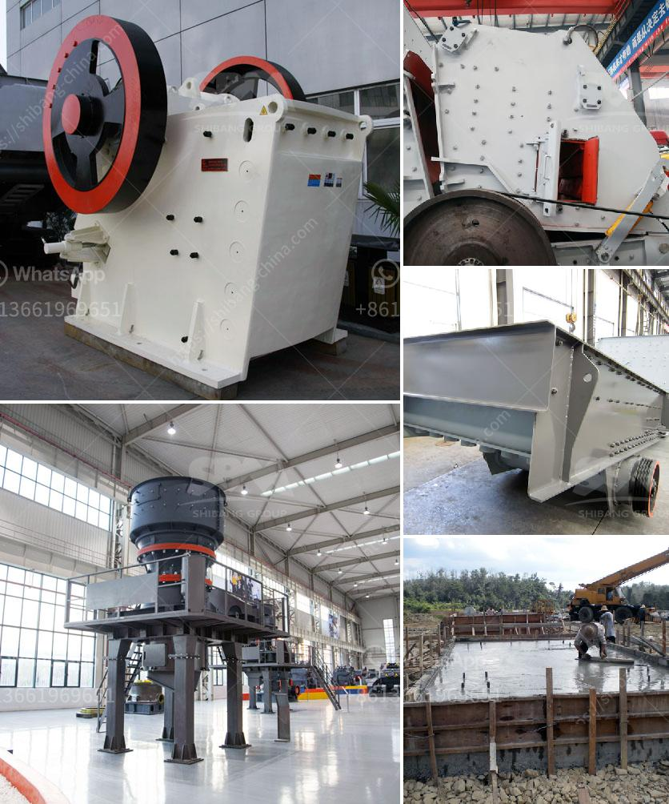

<h3>how much does it cost per day to run a gold mine</h3>
Gold has been a highly sought-after precious metal for centuries, regarded for its beauty and value. However, crafting gold jewelry and bars is merely the final stage in a long and costly process. Operating a gold mine entails substantial expenses, ranging from exploration and extraction to processing and marketing. Understanding the cost per day of running a gold mine is crucial for the industry's success and profitability.

Before any gold mine can start operations, significant investments are required. Exploration costs involve geologists and mining engineers assessing potential sites, conducting feasibility studies, and identifying valuable deposits. Site development includes clearing land, building access roads, constructing infrastructure, and establishing essential facilities such as power supply and accommodation for workers.

Once a suitable location has been identified and necessary infrastructure established, the process of extracting gold ore begins. Extraction costs involve drilling, blasting, and hauling of rocks, as well as various mining techniques, including open-pit or underground mining. Mining machinery, equipment maintenance, and fuel expenses are also accounted for in this phase.

After extraction, the gold-bearing ore needs to be processed to separate gold from other elements or minerals. Processing costs involve grinding the ore into a fine powder and using chemicals (such as cyanide or mercury) to extract gold through a process known as heap leaching or flotation. Furthermore, refining processes are then required to purify the extracted gold, resulting in additional costs.

Labor costs form a significant part of the overall daily expenses of gold mines. Skilled workers, such as geologists, engineers, miners, and processing plant operators, are necessary for the entire operation. Supporting staff, including administrators, security personnel, and maintenance crews, are also indispensable. The cost of employee salaries, training, healthcare, and benefits adds to the overall expenditure.

Once the gold has been extracted, refined, and processed, it needs to be marketed and sold. Marketing expenses include transportation, insurance, and advertising. Administrative costs encompass compliance with environmental and safety regulations, as well as maintaining licenses and permits.

Running a gold mine involves extensive investment across all stages, from exploration to marketing and administration. The cost per day to run a gold mine can vary significantly depending on factors such as the size of the operation, the quality of the ore, labor requirements, and prevailing market conditions. By accurately assessing expenses and optimizing operational efficiency, gold mining companies can ensure sustainable operations and a satisfactory return on investment in this lucrative but challenging industry.
<h3>Contact us</h3><ul><li><strong>Whatsapp:&nbsp;<a href="https://wa.me/8613661969651">+8613661969651</a></strong></li><li><a href="https://swt.shibang-china.com/?git&amp;zhl&amp;how much does it cost per day to run a gold mine"><strong>Online Service(chat now)</strong></a></li></ul><h3>Related</h3><ul><li><a href='silica sand beneficiation plant for glass.md'>silica sand beneficiation plant for glass</a></li><li><a href='capital cost for iron ore pellet plant in india.md'>capital cost for iron ore pellet plant in india</a></li><li><a href='graphite manufacturing youtube.md'>graphite manufacturing youtube</a></li><li><a href='stone crusher supplier company.md'>stone crusher supplier company</a></li><li><a href='busines project proposal for stone crusher.md'>busines project proposal for stone crusher</a></li></ul>