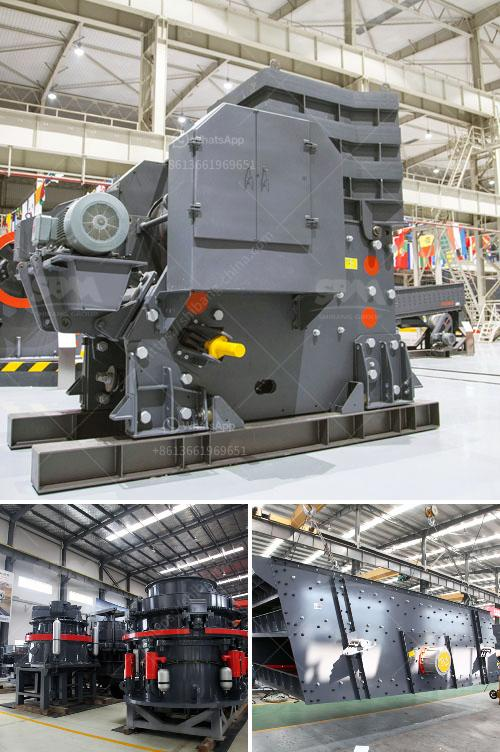

<h3>how much is a gold crusher in kenya</h3>
Kenya has a rich abundance of natural resources, including gold deposits that have the potential to support its economy. Gold mining and exploration have been key contributors to the country's GDP, attracting both local and international investors. One essential piece of equipment in gold mining is a gold crusher, used to extract the precious metal from rocks and ores. But how much does a gold crusher cost in Kenya?

The cost of a gold crusher in Kenya can vary depending on several factors. These factors include the type of crusher, the size and capacity of the machine, as well as the level of automation and production efficiency. Additionally, market demand and the availability of spare parts might also influence the price.

The most common type of gold crusher in Kenya is the jaw crusher. It is essential for breaking large rocks into smaller particles, which can be further processed and refined through various methods to extract gold. Jaw crushers are known for their high performance and durability, making them popular in the mining industry.

In terms of capacity, gold crushers in Kenya can range from a few tons per hour to several hundred tons. The larger the capacity, the higher the price due to the more sophisticated technology and higher production efficiency. Moreover, crushers with higher capacity allow for faster processing and increased overall productivity.

Automation is another factor that affects the price of a gold crusher. Fully automated crushers require less human interaction and can operate continuously, thereby improving efficiency. However, these advanced features come at a higher cost compared to manual or semi-automated machines.

The demand for gold crushers also has an impact on their price. If there is high demand and limited supply, the prices are likely to rise. Conversely, if the demand is low, prices may be more competitive. Additionally, the availability of spare parts and maintenance services can also affect the cost. A well-maintained crusher can last longer and perform better, but regular servicing and replacement of parts can add to the overall expenses.

Furthermore, prices might vary depending on the supplier or manufacturer. Different companies offer crushers with varying quality, reliability, and customer support. It is essential for potential buyers to conduct thorough research and compare prices from different suppliers to find the most suitable and cost-effective option.

When considering purchasing a gold crusher in Kenya, it is crucial to choose a reliable and reputable supplier. Researching and reading customer reviews can provide insight into the quality and performance of the product. Additionally, seeking advice from experienced individuals in the mining industry can help make an informed decision.

In conclusion, the cost of a gold crusher in Kenya depends on various factors, including the type, size, capacity, automation level, and market demand. Buyers should consider these factors and evaluate suppliers before making a purchase. Investing in a reliable gold crusher is crucial for efficient and profitable gold mining operations.
<h3>Contact us</h3><ul><li><strong>Whatsapp:&nbsp;<a href="https://wa.me/8613661969651">+8613661969651</a></strong></li><li><a href="https://swt.shibang-china.com/?git&amp;zhl&amp;how much is a gold crusher in kenya"><strong>Online Service(chat now)</strong></a></li></ul><h3>Related</h3><ul><li><a href='methods of hammer mill.md'>methods of hammer mill</a></li><li><a href='conveyor for sale in malaysia.md'>conveyor for sale in malaysia</a></li><li><a href='crusher plant for sale in mardan.md'>crusher plant for sale in mardan</a></li><li><a href='ball mill for silica grinding made in japan.md'>ball mill for silica grinding made in japan</a></li><li><a href='rock hammer mill for sale.md'>rock hammer mill for sale</a></li></ul>