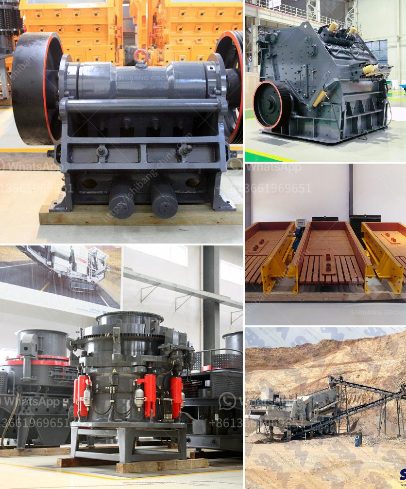

<h3>how much is jaw crusher</h3>
Crushing is a vital process conducted in various industries, but it requires substantial investment in terms of time, money, and effort. The selection of the right crushing equipment is crucial to ensure that the process performs efficiently, both in terms of output and cost-effectiveness. One of the most popular types of crushing equipment is the jaw crusher, known for its robust construction, high efficiency, and versatility.

A jaw crusher is a machine designed to reduce large rocks into smaller rocks, gravel, or rock dust, making them extremely useful tools for construction, mining, metallurgy, and other industries. Jaw crushers are typically composed of a fixed jaw and a movable jaw that moves back and forth to crush materials. The jaws are driven by a motor, with the vertical movement of the jaws being controlled by an eccentric shaft rotation mechanism.

When it comes to pricing, jaw crushers can vary significantly depending on the size, brand, and features of the specific model. Additionally, factors such as production capacity, feed size, and required end product size may also affect the cost. In general, jaw crushers with a higher capacity will tend to be more expensive, as they have more powerful motors and stronger components to handle larger quantities of material.

To give you a rough estimate, a jaw crusher with a capacity of 300-500 tons per hour could cost around $60,000 to $70,000. The cost will vary depending on the specific model, brand, and dealership.

However, it is important to consider not just the initial purchase price but also the long-term operational costs when investing in a jaw crusher. High quality jaw crushers are designed to provide reliable performance and low maintenance, reducing the overall cost over the lifespan of the machine.

Using a jaw crusher can significantly reduce material preparation costs, as it eliminates the need for multiple stages of crushing and screening. Instead, the material can be directly fed into the jaw crusher, which reduces the resources required for crushing, such as manpower, equipment, and time.

Furthermore, the versatility of jaw crushers allows them to handle various types of materials, including hard rocks and ores. This versatility means that a single jaw crusher can be used for multiple applications, reducing the need for additional equipment and further optimizing cost-effectiveness.

In conclusion, investing in a jaw crusher is a cost-effective solution for crushing hard materials. While the initial purchase price may seem high, the long-term operational benefits, such as reduced material preparation costs and increased efficiency, make it a worthwhile investment. It is also essential to choose a reliable brand and model that meets your specific needs and provides a balance between price and performance. With proper maintenance and care, a jaw crusher can serve as a reliable and durable crushing solution for years to come.
<h3>Contact us</h3><ul><li><strong>Whatsapp:&nbsp;<a href="https://wa.me/8613661969651">+8613661969651</a></strong></li><li><a href="https://swt.shibang-china.com/?git&amp;zhl&amp;how much is jaw crusher"><strong>Online Service(chat now)</strong></a></li></ul><h3>Related</h3><ul><li><a href='bauxite crusher plant construction.md'>bauxite crusher plant construction</a></li><li><a href='cone crusher sri lanka for sale.md'>cone crusher sri lanka for sale</a></li><li><a href='rock crushers prices.md'>rock crushers prices</a></li><li><a href='vail crushing meachine models in pharma.md'>vail crushing meachine models in pharma</a></li><li><a href='components of a limestone primary plant.md'>components of a limestone primary plant</a></li></ul>