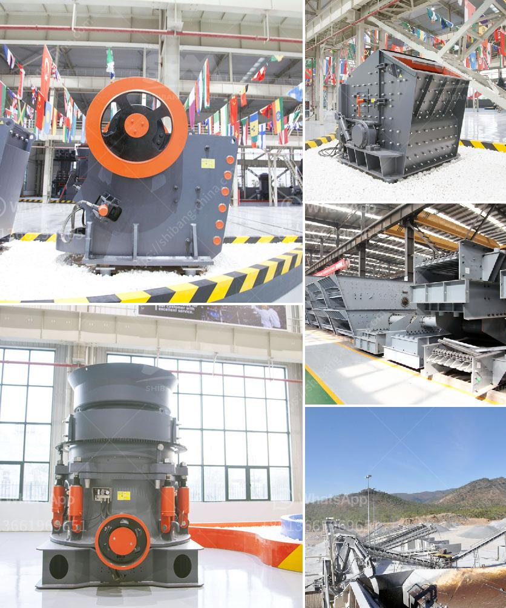

<h3>how to acid washing silica sand</h3>
Acid washing silica sand is a simple procedure that involves preparing a sodium silicate solution, sodium hydroxide solution, and hydrochloric acid. The process removes unwanted impurities, such as iron and other heavy minerals, by dissolving them away with acid. Acid washing also helps to increase the silica sand's purity, making it suitable for a wide range of applications, including glass manufacturing and water filtration.

To begin the acid washing process, you will need to gather the necessary materials and set up a safe work area. Wear protective gloves, goggles, and a lab coat to protect yourself from any potential hazards. Ensure good ventilation in the room to avoid exposure to harmful fumes. Here are the steps to follow:

1. Prepare a sodium silicate solution by dissolving sodium silicate in water. This solution will act as a binder to hold the silica sand particles together during the acid washing process.

2. In a separate container, prepare a sodium hydroxide solution by dissolving sodium hydroxide pellets or flakes in water. This solution will be used to adjust the pH of the silica sand mixture.

3. Combine the sodium silicate solution and the silica sand in a suitable mixing vessel, ensuring that the sand is evenly coated with the binder. Stir the mixture thoroughly to achieve a homogenous consistency.

4. Slowly add the sodium hydroxide solution to the mixture, while continuously stirring. The sodium hydroxide will raise the pH of the mixture, making it alkaline.

5. Carefully add hydrochloric acid to the mixture, drop by drop. The acid will neutralize the alkalinity and dissolve any unwanted impurities present in the silica sand.

6. Continue stirring the mixture for a few minutes to ensure thorough contact between the acid and the sand particles.

7. Once the desired impurity removal is achieved, stop the acid addition and remove the mixture from the vessel.

8. Rinse the acid-washed silica sand thoroughly with deionized water to remove any remaining acid or impurities.

9. Allow the washed silica sand to dry in an oven or under the sun before using it for your desired application.

Remember to handle all chemicals with caution and follow proper safety protocols during the acid washing process. It is also crucial to dispose of any acid and chemical waste properly, following your local regulations.

By following these steps, you can successfully acid wash silica sand, improving its purity for various industrial applications. The resulting cleaned sand will exhibit enhanced physical and chemical properties, ensuring optimal performance in its intended use.
<h3>Contact us</h3><ul><li><strong>Whatsapp:&nbsp;<a href="https://wa.me/8613661969651">+8613661969651</a></strong></li><li><a href="https://swt.shibang-china.com/?git&amp;zhl&amp;how to acid washing silica sand"><strong>Online Service(chat now)</strong></a></li></ul><h3>Related</h3><ul><li><a href='3 tom capecity ball mill.md'>3 tom capecity ball mill</a></li><li><a href='ultra fine milling machines.md'>ultra fine milling machines</a></li><li><a href='conveyor belt pricing in malaysia.md'>conveyor belt pricing in malaysia</a></li><li><a href='100tph gold ore processing plant.md'>100tph gold ore processing plant</a></li><li><a href='raymond mill and high pressure difference.md'>raymond mill and high pressure difference</a></li></ul>