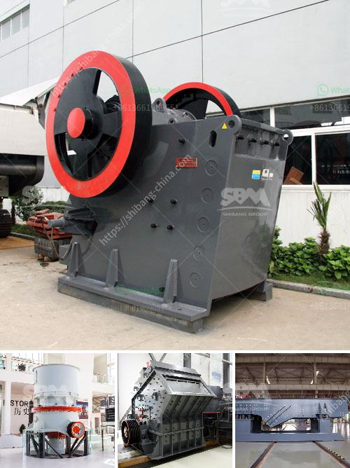

<h3>how to build a gold washing plant</h3>
Gold mining has been a lucrative industry for many centuries, attracting countless prospectors with the promise of wealth and adventure. If you are considering venturing into the gold mining business, a gold washing plant is undoubtedly a piece of equipment that can significantly enhance your chances of success. With proper planning and implementation, a gold washing plant can efficiently extract large quantities of gold-rich ore deposits. In this article, we will guide you step by step on how to build your own gold washing plant.

Before commencing construction, it is essential to design a layout that caters to your specific site conditions, available resources, and budget. Key considerations include the type of deposit (alluvial or hard rock), expected capacity, water availability, and environmental factors. A successful gold washing plant should incorporate robust equipment, efficient gold recovery systems, and reliable water management.

1. Excavators or Bulldozers: Heavy machinery is essential to remove overburden and expose gold-bearing deposits. Ensure that the equipment can withstand the demanding conditions of your site.

2. Trommel or Vibrating Screen: The primary screening device is crucial in separating larger stones, rocks, and debris from the finer gold-bearing gravel. Choose a trommel or vibrating screen with the appropriate size and mesh to suit your requirements.

3. Sluice Box or Jigging System: These equipment options provide efficient gold concentration and recovery. A sluice box employs riffles to trap gold particles, while a jigging system uses pulsating water to stratify the gold particles based on their density.

4. Water Pump: A reliable water supply is vital for washing the ore and maintaining the efficient operation of the plant. Select a water pump that can handle the required flow rate and pressure.

1. Site Preparation: Clear the area of vegetation and level the ground. Excavate trenches for water pipelines and create a stable foundation for the washing plant's equipment.

2. Install Water Supply: Lay pipelines to transport water from a nearby source, such as a river or water storage reservoir, to the washing plant. Incorporate sediment filters to prevent blockages.

3. Set up Equipment: Install the excavators, trommel or vibrating screen, sluice box or jigging system, and the necessary conveyors. Ensure all components are securely fastened for stable operation.

4. Test and Adjust: Before starting full-scale production, run tests with a small batch of ore to fine-tune the equipment settings. During this phase, optimize the water flow, screen mesh size, and sluice box or jigging system angle for the best gold recovery.

5. Operation and Maintenance: Regularly inspect and clean all equipment to prevent breakdowns and maintain optimal performance. Monitor the water supply, gold recovery rates, and overall plant operation closely.

Building a gold washing plant requires careful planning, investment, and operational expertise. By following the steps outlined in this guide, you can construct an efficient gold washing plant that maximizes your chances of extracting significant quantities of gold. Remember to prioritize safety and environmental considerations throughout the construction and operation phases. With perseverance and responsible mining practices, your gold washing plant can become a prosperous venture in the lucrative gold mining industry.
<h3>Contact us</h3><ul><li><strong>Whatsapp:&nbsp;<a href="https://wa.me/8613661969651">+8613661969651</a></strong></li><li><a href="https://swt.shibang-china.com/?git&amp;zhl&amp;how to build a gold washing plant"><strong>Online Service(chat now)</strong></a></li></ul><h3>Related</h3><ul><li><a href='how to acid washing silica sand.md'>how to acid washing silica sand</a></li><li><a href='copper ore refinement processors philippines.md'>copper ore refinement processors philippines</a></li><li><a href='want to buy stone crusher in canada.md'>want to buy stone crusher in canada</a></li><li><a href='sand and gravel separator machine for sale philippines.md'>sand and gravel separator machine for sale philippines</a></li><li><a href='crusher gap crusher.md'>crusher gap crusher</a></li></ul>