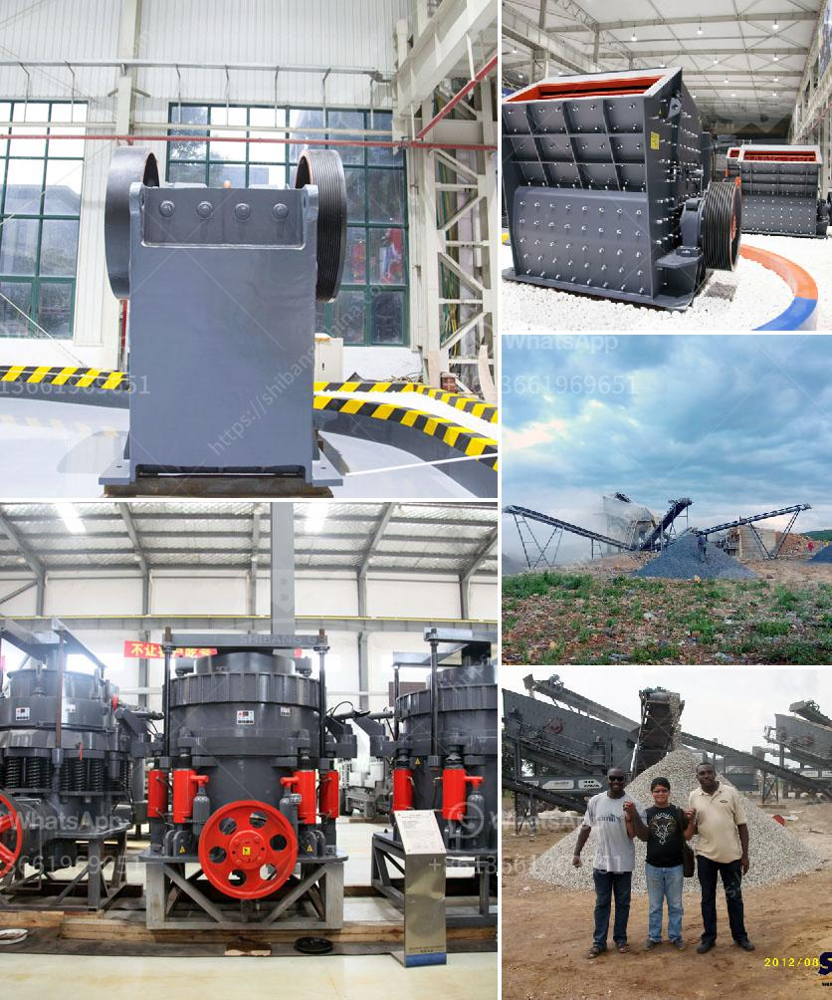

<h3>how to build a stone crusher</h3>
Stone crushing is an essential part of the construction industry and acts as a primary source of materials for various infrastructure projects such as roads, highways, bridges, buildings, canals, etc. It is also an important sector in the industrial sector. The stone crusher is becoming more and more popular in nowadays, of course, the development of the stone crusher is based on its advantages.

Stone crushing is a tedious and costly process, especially when the stones are sourced from large quarries. However, there are alternatives available which can be used to create pavement and other heavy-duty construction projects. One such option is using a stone crusher machine to convert the stones to gravel, thereby reducing the superior construction cost.

A stone crusher machine is a powerful device that is extensively used in construction, mining, quarrying, and other industries. However, the impact of a stone crusher may vary depending on the user's specific requirements. The machine has various types such as jaw crusher, impact crusher, cone crusher, vibrating screen and etc.

To understand how the stone crusher machine works, we must first unravel the mystery behind the various components and mechanisms inside the machine.

The main purpose of the machine is to reduce large rocks into smaller rocks, gravel, or rock dust. The machine works by using a motor to power a belt that crushes the stones into smaller pieces. The machine also has a feed hopper that ensures a consistent supply of rocks to be crushed. The crushed stones then pass through a vibrating screen that separates different sizes of stones according to their uses.

To build a stone crusher machine, you need to know the diameter of the stone so that you can outline its circumference. In simple terms, you need to measure the size of the stone and then multiply it by the required height. The final result is an approximate estimation of the stone's volume, which will allow you to choose the appropriate machine specifications.

Once you have chosen the appropriate machine, you can start assembling the various components. Begin by mounting the motor and belt assembly onto a sturdy base or frame. Make sure the motor is securely fastened and that the belt is properly aligned. Next, attach the feed hopper to the motor assembly. The feed hopper should have a mechanism to control the flow of rocks into the machine.

After setting up the motor and feed hopper, install the moving parts of the machine. This includes the crusher plates, which are responsible for crushing the stones into smaller pieces. It is important to ensure that the crusher plates are properly aligned and adjusted to allow a consistent and efficient crushing process.

Finally, install the vibrating screen at the output end of the machine. The vibrating screen helps separate the crushed stones into different sizes according to their use. This ensures that only the required size of stones is used for construction purposes, which helps reduce wastage and improve the overall quality of the final product.

Building a stone crusher machine requires a lot of time, effort, and technical expertise. However, with the right resources and guidance, anyone can successfully build their own stone crusher machine. Through this article, we hope to provide a basic understanding of stone crushing machines and their various components. We believe that by following the steps outlined above, anyone can build their own stone crusher and contribute to the construction industry in an efficient and sustainable manner.
<h3>Contact us</h3><ul><li><strong>Whatsapp:&nbsp;<a href="https://wa.me/8613661969651">+8613661969651</a></strong></li><li><a href="https://swt.shibang-china.com/?git&amp;zhl&amp;how to build a stone crusher"><strong>Online Service(chat now)</strong></a></li></ul><h3>Related</h3><ul><li><a href='roller crusher discount.md'>roller crusher discount</a></li><li><a href='construction of vibrating screen.md'>construction of vibrating screen</a></li><li><a href='feldspar grinding machine manufacturers in india.md'>feldspar grinding machine manufacturers in india</a></li><li><a href='costo de instalacion de planta de cemento.md'>costo de instalacion de planta de cemento</a></li><li><a href='quarry business cost in india.md'>quarry business cost in india</a></li></ul>