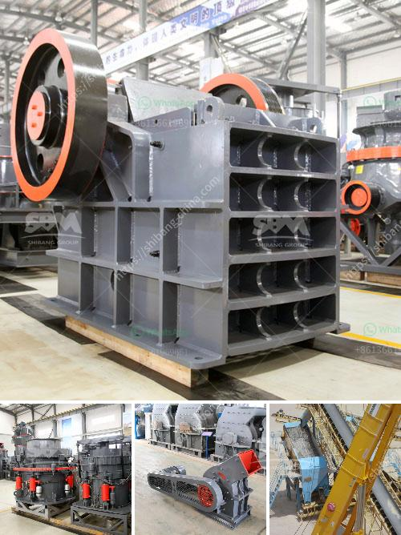

<h3>how to find out to crushing capacity of ball mill</h3>
A ball mill is a type of grinder used to grind materials into extremely fine powder for use in mineral dressing processes, paints, pyrotechnics, ceramics, and selective laser sintering. The ball mill is a key piece of equipment for grinding crushed materials, and it is widely used in production lines for powders such as cement, silicates, refractory material, fertilizer, glass ceramics, etc. as well as for ore dressing of ferrous and non-ferrous metals. With these characteristics, the ball mill has a vast application range and it is widely used in countless industries.

The crushing capacity of a ball mill refers to the amount of material that the ball mill can process per unit time, while the actual production capacity is closely related to the actual production workload and subsequent production indexes. In this article, we will discuss several factors that affect the crushing capacity of a ball mill.

The grinding medium in the ball mill usually includes steel balls, steel segments, etc. The proportion and distribution of different medium will affect the grinding effect and grinding capacity. If too many large steel balls are added, the crushing capacity of the ball mill will increase, but the power consumption of the ball mill will also increase. In addition, a reasonable ratio of steel balls can also improve the grinding efficiency.

The rotational speed of the ball mill barrel affects its crushing capacity and grinding efficiency. The theoretical critical speed of a ball mill is the speed at which the centrifugal force is equal to the gravitational force acting on the mill's particles. Therefore, the mill's crushing capacity can be improved by increasing the rotational speed.

The shape and weight of the mill liner have a great influence on the grinding effect and crushing capacity of the ball mill. In general, the shape of the liner mainly includes three types: wave-shaped liner, convex ribbed liner, and smooth liner. Different liner shapes can achieve different crushing effects. The weight of the liner also affects the grinding capacity, but excessive weight will increase energy consumption.

The hardness of the material being ground by the ball mill affects its crushing capacity. The harder the material, the higher the energy consumption required to crush it. Therefore, to improve the crushing capacity, the hardness of the material should be appropriately reduced, such as by pre-crushing or softening treatment.

The feed size of the ball mill is an important factor to be considered when designing the ball mill. Generally, the appropriate feed size is determined by the particle size distribution of the raw material, the grinding process requirements, and the grinding capacity required by subsequent beneficiation processes.

In conclusion, the crushing capacity of a ball mill is influenced by various factors including grinding medium and its distribution, mill speed, liner shape and weight, material hardness, and ball mill feed size. It is important to analyze and study these factors in order to optimize the crushing capacity, improve efficiency, and achieve better production results.
<h3>Contact us</h3><ul><li><strong>Whatsapp:&nbsp;<a href="https://wa.me/8613661969651">+8613661969651</a></strong></li><li><a href="https://swt.shibang-china.com/?git&amp;zhl&amp;how to find out to crushing capacity of ball mill"><strong>Online Service(chat now)</strong></a></li></ul><h3>Related</h3><ul><li><a href='how to build a stone crusher.md'>how to build a stone crusher</a></li><li><a href='stone crusher in ksa.md'>stone crusher in ksa</a></li><li><a href='cost of granite crushing equipment.md'>cost of granite crushing equipment</a></li><li><a href='basalt crusher machine prices.md'>basalt crusher machine prices</a></li><li><a href='jaw crusher seller in pakistan.md'>jaw crusher seller in pakistan</a></li></ul>