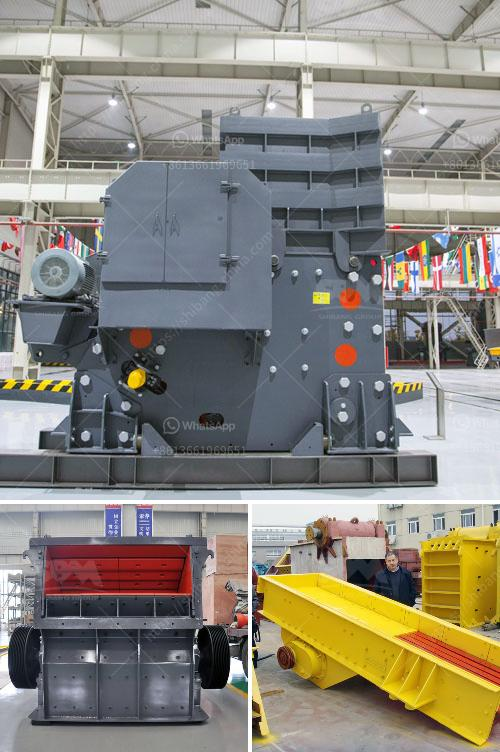

<h3>how to improve technology of mining low grade ore</h3>
Mining plays a crucial role in the global economy, providing essential minerals for various industries. However, as high-grade ore becomes scarcer, the industry must shift its focus towards extracting and processing low-grade ore efficiently. Technological advancements hold the key to improving the extraction and processing techniques, ensuring sustainable mining practices and maximizing the use of valuable resources.

One of the initial steps in mining low-grade ore is conducting comprehensive geological surveys. Implementing advanced remote sensing techniques, such as LiDAR (Light Detection and Ranging) and satellite imagery, can provide precise data on the mineral deposits. This allows for accurate identification of viable extraction locations, increasing efficiency and reducing operational costs.

To effectively extract minerals from low-grade ore, advanced separation and sorting systems must be employed. Modern technologies, such as sensor-based sorting, X-ray transmission, and magnetic separation, enable automated detection and sorting of valuable minerals. This not only improves the quality of the extracted ore but also reduces the need for manual labor, ensuring a safer and more cost-effective mining operation.

Low-grade ore typically requires extensive grinding and crushing processes to increase liberation of valuable minerals. Utilizing cutting-edge technologies, such as high-pressure grinding rolls and advanced comminution circuits, can efficiently reduce the particle size while minimizing energy consumption. Such techniques accelerate the separation of valuable minerals from waste material, boosting productivity and saving resources.

Mining low-grade ore often involves complex environmental challenges. Implementing eco-friendly and sustainable practices can significantly reduce the impact on ecosystems. Utilizing advanced water treatment and recycling systems minimizes water consumption, while reverting to renewable energy sources decreases carbon emissions. Integrating these sustainable approaches into mining operations ensures a more responsible and environmentally conscious industry.

With the depletion of high-grade ore deposits, improving the technology of mining low-grade ore is crucial for the sustainability of the mining industry. Incorporating intelligent geological surveying, advanced separation techniques, efficient grinding and crushing methods, and sustainable practices will enhance the extraction and processing efficiency, minimizing waste and maximizing the utilization of valuable resources. Continuous research and innovation in mining technologies will be essential to meet the increasing global demand for minerals while safeguarding the environment.
<h3>Contact us</h3><ul><li><strong>Whatsapp:&nbsp;<a href="https://wa.me/8613661969651">+8613661969651</a></strong></li><li><a href="https://swt.shibang-china.com/?git&amp;zhl&amp;how to improve technology of mining low grade ore"><strong>Online Service(chat now)</strong></a></li></ul><h3>Related</h3><ul><li><a href='gyratory crusher prices.md'>gyratory crusher prices</a></li><li><a href='equipment for gold refinery.md'>equipment for gold refinery</a></li><li><a href='stone crusher equipment quarry.md'>stone crusher equipment quarry</a></li><li><a href='quarry crushing suppliers.md'>quarry crushing suppliers</a></li><li><a href='used quarry crusher in south africa.md'>used quarry crusher in south africa</a></li></ul>