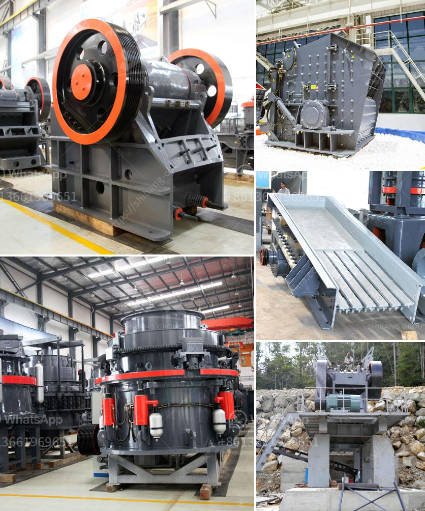

<h3>how to make a iron ore crusher machine</h3>
Iron ore is one of the most important materials in the mining industry. It is the main ingredient for the production of steel and many other products used in various industries such as transportation, construction, machinery, appliances, and electronics. As a result, the demand for iron ore crusher machines is constantly increasing.

In recent years, with the rise of the mining industry, iron ore crushers have been widely used. However, there are a variety of iron ore crushers with different performances and prices to meet different needs. Some of the common iron ore crushers include jaw crusher, cone crusher, hammer crusher, and roller crusher.

Jaw crusher is the most important and widely used primary crushing plants in mining industry. It has the advantages of high crushing ratio, production capacity, and even product size. Jaw crusher is extensively used in mining, metallurgy, construction, highway, and railway industry etc. for primary crushing materials with medium hardness and soft hardness.

Cone crusher is suitable for crushing various ores and rocks with medium and above hardness. It has the features of reliable structure, high production efficiency, convenient adjustment, and economical use. The spring safety system is the overload protection device which can make the iron go through the crushing chamber without damaging the machine. It adopts two sealing means: dry oil and water to separate stone powders and lubrication grease, to ensure reliable work of the machine.

Hammer crusher is mainly used for the crushing of brittle materials like coal, gangue, coke, slag, red sandstone, shale, limestone, and gypsum, etc. It is widely used in various industries such as cement, construction, ceramics, power and metallurgy industry. In addition, hammer crusher not only can be used for crushing production line, sand production line, but also can replace the cone crusher in beneficiation production line.

Roller crusher is a very old crushing equipment that appeared in 1806, and its structure is simple. It can crushers iron ore, Quartz Stone, rock gold, rock tantalum niobium ore, rock tin ore, rock tungsten ore, manganese ore, ilmenite ore, K-albite, limestone, river pebbles, copper ore, bauxite, barite, basalt, etc.

Therefore, iron ore crusher has been widely used in large iron ore processing plants. Iron ore crusher can be widely used in metallurgical industry, building industry, road building industry, chemical industry and phosphate industry, suitable for crushing hard and medium hard ores and rocks (such as iron ore, copper ore, limestone, quartz, granite, sandstone, etc.)

The cone crusher is the best crusher at present, with low power consumption and high productivity in the crushing process. This is the biggest advantage of the cone crusher. Therefore, although the material produced by the cone crusher usually needs to be shaped by a vertical impact crusher and a shaping sand making machine. But in the large-scale crushing production line, the role that the cone crusher plays cannot be ignored.

In summary, in the iron ore crushing process, the choice of equipment is critical. The cone crusher and iron ore impact crusher are two indispensable machines in Iron ore crushing production line. If you want to get more detailed product information and prices, XSM recommend that you get in touch with us through online chat.
<h3>Contact us</h3><ul><li><strong>Whatsapp:&nbsp;<a href="https://wa.me/8613661969651">+8613661969651</a></strong></li><li><a href="https://swt.shibang-china.com/?git&amp;zhl&amp;how to make a iron ore crusher machine"><strong>Online Service(chat now)</strong></a></li></ul><h3>Related</h3><ul><li><a href='quratz crusher price.md'>quratz crusher price</a></li><li><a href='rotary dryer for sale in india.md'>rotary dryer for sale in india</a></li><li><a href='aggregate crusher plant layout.md'>aggregate crusher plant layout</a></li><li><a href='rock crushing plant capacity 250 tph.md'>rock crushing plant capacity 250 tph</a></li><li><a href='crusher materials cone crusher mining.md'>crusher materials cone crusher mining</a></li></ul>