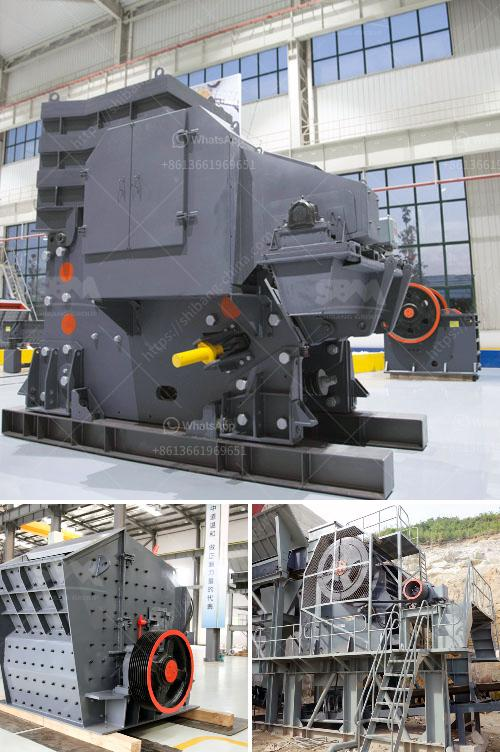

<h3>how to pulverized limestone crusher</h3>
Crushed limestone is a key ingredient in construction aggregate, the solid base of many roads. It's also used in the asphalt that covers the road. Limestone is a crucial material for road construction and shows no signs of slowing down as we look to update our roads and urban infrastructure. Using lime as a chemical binder in road construction also provides a high-quality, cost-effective base. After limestone is crushed and screened, it can be used in diverse applications such as concrete and asphalt aggregates, soil conditioner, road base materials, and agricultural limestone.

Given its versatile functionality, pulverizing limestone is a critical step in the process of manufacturing high-quality cement. Used along with additives, limestone undergoes various stages of crushing and pulverizing before cement production commences. To crush limestones efficiently, a pulverizer, capable of handling raw limestone, is required.

   Limestone contains high levels of moisture and needs to be dried before processing. A pulverizer designed for high moisture content materials will ensure consistent size reduction and easy handling.

   A well-maintained pulverizer helps achieve optimal crushing efficiency. Regularly inspecting the pulverizer mechanism for wear and tear, and promptly addressing any issues, will ensure consistent performance and prevent unexpected downtime.

   Each pulverizer has its own set of optimal settings for crushing limestone. Collaborate with experts or the pulverizer manufacturer to determine the optimal settings for effectively crushing limestone to the desired size.

   Investing in a high-quality pulverizer will pay off in the long run by ensuring consistent and efficient crushing. Cheaper alternatives may save money initially but can lead to frequent breakdowns and increased maintenance costs.

   Proper maintenance of crushing equipment, such as regular lubrication and timely replacement of worn parts, will prolong the lifespan of the pulverizer. It is essential to follow manufacturer guidelines for maintenance to prevent costly repairs and downtime.

   Controlling the feed size of limestone into the pulverizer is crucial for efficient crushing. Oversized materials may jam the pulverizer or lead to uneven crushing. Consider implementing a screening process to ensure uniform feed size.

In conclusion, crushing limestone with a pulverizer requires diligent planning and careful execution. By following the tips and tricks outlined above, you can maximize the efficiency and effectiveness of your crushing process. Investing in high-quality equipment, implementing proper maintenance, and optimizing crusher settings are key steps in achieving consistent and reliable results. By pulverizing limestone efficiently, you can produce high-quality aggregates for a variety of construction and manufacturing needs, contributing to the growth and development of our infrastructure.
<h3>Contact us</h3><ul><li><strong>Whatsapp:&nbsp;<a href="https://wa.me/8613661969651">+8613661969651</a></strong></li><li><a href="https://swt.shibang-china.com/?git&amp;zhl&amp;how to pulverized limestone crusher"><strong>Online Service(chat now)</strong></a></li></ul><h3>Related</h3><ul><li><a href='mobile crusher for sale in philippines.md'>mobile crusher for sale in philippines</a></li><li><a href='iron ore dry grinding systems.md'>iron ore dry grinding systems</a></li><li><a href='limestone processing plant in benin.md'>limestone processing plant in benin</a></li><li><a href='crusher and screening plants for sale.md'>crusher and screening plants for sale</a></li><li><a href='mobile crushing price uk.md'>mobile crushing price uk</a></li></ul>