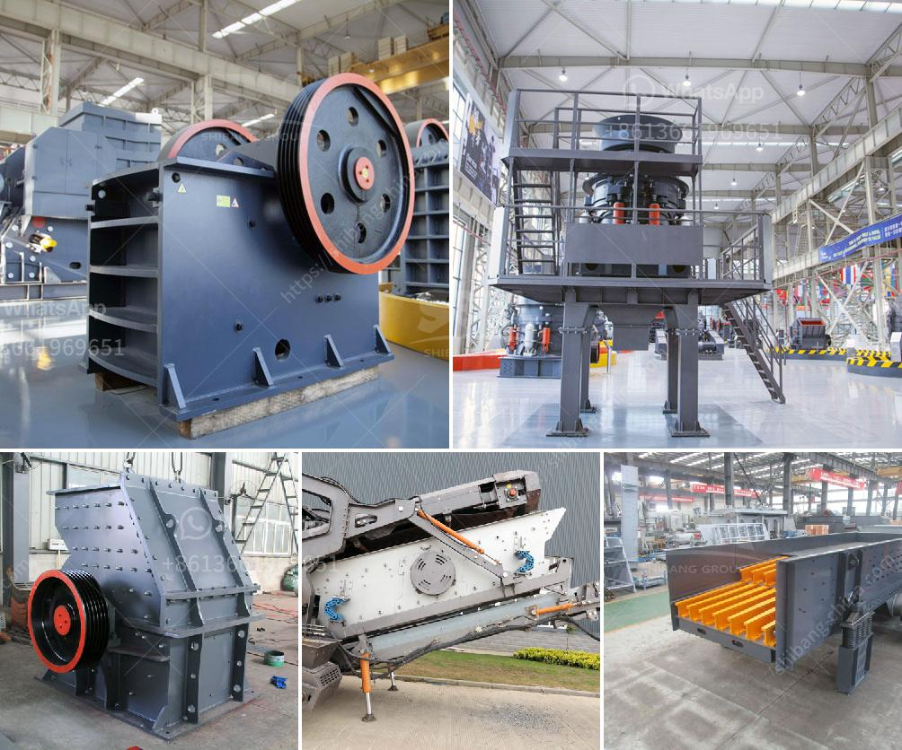

<h3>how to put together a stone crusher</h3>
A stone crusher is a crucial piece of equipment for any construction or mining project. It utilizes a jaw crusher to crush stones into small-sized particles for various purposes such as for the construction of roads, buildings, bridges, and more. Stone crushers can also be utilized in other industries like mining, agriculture, and forestry.

Putting together a stone crusher requires skills and expertise. Therefore, it is best to hire professionals for a hassle-free installation process. However, some key points should be kept in mind while setting up a stone crusher.

Firstly, choosing the right location is essential. In cases where the stone crusher needs to be relocated after establishing, a suitable location should be selected that is easily accessible to transportation routes and has adequate space to accommodate the crusher, conveyor belts, and other associated equipment.

Once the location is finalized, the foundation for the stone crusher needs to be prepared. The foundation should be stable and strong enough to support the weight of the crusher and endure the vibrations caused during the crushing process. A professional engineer or contractor should be consulted to ensure the foundation is built correctly.

After the foundation is ready, the stone crusher can be assembled. It is important to follow the manufacturer's instructions to ensure that each component is securely attached. This includes connecting the crusher to its power source, as well as installing conveyor belts, screens, and other auxiliary equipment.

Before operation, ensure that all parts are properly lubricated and that the crusher is correctly adjusted for the desired output size. Regular maintenance and inspection should also be conducted to ensure the crusher is in optimal condition and prevent any costly breakdowns.

In summary, putting together a stone crusher involves careful planning and professional assistance. By considering all necessary factors and following proper installation procedures, the stone crusher will be ready to crush rocks and contribute to various construction projects efficiently.
<h3>Contact us</h3><ul><li><strong>Whatsapp:&nbsp;<a href="https://wa.me/8613661969651">+8613661969651</a></strong></li><li><a href="https://swt.shibang-china.com/?git&amp;zhl&amp;how to put together a stone crusher"><strong>Online Service(chat now)</strong></a></li></ul><h3>Related</h3><ul><li><a href='hammer grinding machine philippines.md'>hammer grinding machine philippines</a></li><li><a href='looking for washing plant for gold germany.md'>looking for washing plant for gold germany</a></li><li><a href='quartz crushing machine price.md'>quartz crushing machine price</a></li><li><a href='italia crusher machine.md'>italia crusher machine</a></li><li><a href='slag crusher machine kenya.md'>slag crusher machine kenya</a></li></ul>