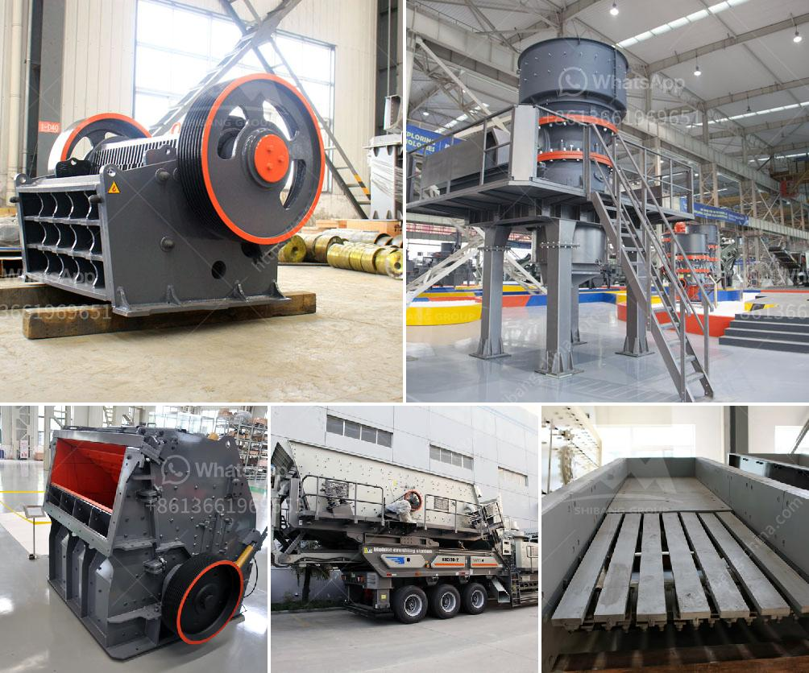

<h3>how to set up a stone quarry company</h3>
Starting a stone quarry company is a major undertaking that involves a great deal of planning and preparation. It's important to understand the various aspects involved in setting up a quarry to ensure that the process runs smoothly and the stone quarry company becomes successful.

The first step in establishing a stone quarry company is to identify the objectives of the business. This includes determining the type of materials you plan to mine, your target market, and the resources and equipment you'll need.

Before you begin operating a stone quarry, it's essential to conduct thorough market research. Identify potential customers in your area and determine the demand and market trends. This will help you set realistic sales goals and make informed decisions about the size and scope of your operations.

To set up a stone quarry company, you'll need access to a large deposit of valuable stone. This may involve purchasing or leasing land and acquiring the necessary licenses and permissions from local authorities. It's also important to secure the equipment and resources you'll need to extract and process the stone, such as crushers, bulldozers, loaders, and trucks.

A mining plan outlines the process of extracting and processing the stone from the quarry. This includes identifying the optimal extraction methods, assessing the potential environmental impact, and establishing a timeline for the operation. It's important to consult with geologists and mining engineers to ensure that the plan is effective and compliant with regulations.

A successful stone quarry company relies on a skilled and dedicated workforce. Identify the positions you'll need to fill, such as quarry manager, machine operators, geologists, and administrative staff, and recruit qualified individuals to fill these roles. It's crucial to provide proper training and ensure that all employees adhere to safety protocols and best practices.

Once you have established your stone quarry company, it's essential to create a marketing strategy to attract customers and generate revenue. This may involve creating a website, participating in industry trade shows, and reaching out to potential clients through advertising and networking. It's also important to establish strong relationships with suppliers and contractors in the construction and building industries to secure a steady stream of projects.

Safety and sustainability should be top priorities for any stone quarry company. Ensure that all employees are well-trained in safety procedures and that equipment is regularly inspected and maintained. Implement measures to minimize environmental impact, such as land reclamation and water management practices. Adopting sustainable practices will not only protect the environment but also enhance the company's reputation and attract environmentally conscious customers.

In conclusion, setting up a stone quarry company requires careful planning and attention to detail. By following these steps and investing in the necessary resources and personnel, you can establish a successful quarry operation and contribute to the growth and development of the construction industry.
<h3>Contact us</h3><ul><li><strong>Whatsapp:&nbsp;<a href="https://wa.me/8613661969651">+8613661969651</a></strong></li><li><a href="https://swt.shibang-china.com/?git&amp;zhl&amp;how to set up a stone quarry company"><strong>Online Service(chat now)</strong></a></li></ul><h3>Related</h3><ul><li><a href='vsi crusher price.md'>vsi crusher price</a></li><li><a href='calcium roller mill.md'>calcium roller mill</a></li><li><a href='grinding mills for sale johannesburg.md'>grinding mills for sale johannesburg</a></li><li><a href='quarry machines for sale in kenya.md'>quarry machines for sale in kenya</a></li><li><a href='hammer mill for ldpe grinding.md'>hammer mill for ldpe grinding</a></li></ul>