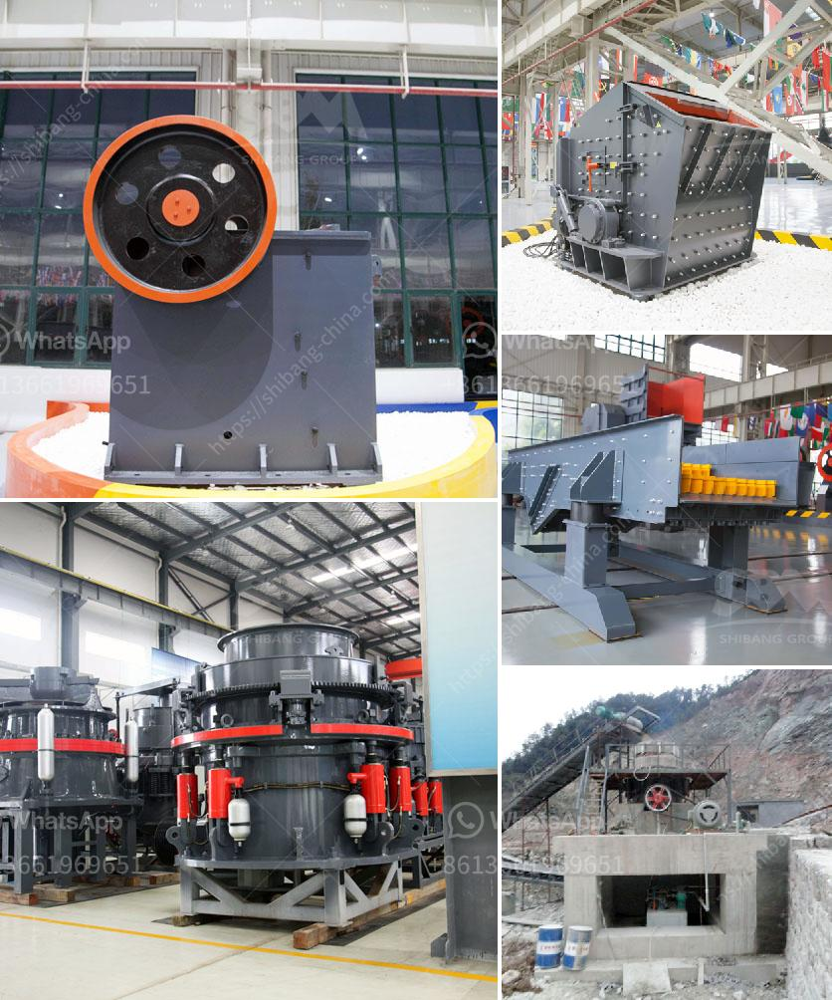

<h3>how to start a concrete block business</h3>
If you have been considering starting your own business and have a knack for construction and building materials, starting a concrete block business might be a lucrative venture. Concrete blocks are a widely used building material, and the demand for them is constantly increasing. By following a few key steps, you can successfully start your own concrete block business.

Before diving into any business venture, it is crucial to conduct thorough research. Understand the market demand and competition in your area. Consider factors such as pricing, quality of products, and customer preferences. Gather information about the necessary permits, licenses, and regulations required to start a concrete block business. Develop a comprehensive business plan that outlines your goals, financial projections, and marketing strategies.

Choosing the right location is vital for the success of your business. Look for an area where there is a high demand for construction materials and a shortage of concrete block suppliers. Additionally, ensure that your location has sufficient space for storing raw materials, production equipment, and finished products.

- Concrete block making machine: This machine is used to produce concrete blocks of various shapes, sizes, and designs.

- Pallets and molds: Essential for ensuring uniformity and to shape the concrete blocks during the production process.

Establish a streamlined production process that allows you to efficiently produce high-quality concrete blocks. Ensure that you have a dedicated area for mixing concrete, production, and storage. Implement stringent quality control measures to ensure that each block meets the required standards. Employ skilled and experienced workers who can handle the production process effectively.

Develop a marketing strategy to create awareness of your business. Advertise through various channels such as social media, print media, and online platforms. Create a professional website with detailed information about your concrete block products and company. Build partnerships with contractors, builders, and construction companies to secure ongoing contracts.

Determine competitive pricing for your concrete blocks based on the cost of raw materials, production expenses, and market demand. Offer discounted rates for bulk purchases, loyalty discounts, or package deals to attract customers. Maintain good relationships with your customers and provide excellent customer service to enhance repeat business.

Starting a concrete block business requires dedication, hard work, and careful planning. By conducting thorough research, investing in quality equipment, implementing effective marketing strategies, and providing excellent products and services, you can successfully establish a profitable concrete block business. Remember to constantly adapt to market trends, listen to customer feedback, and improve your processes to stay ahead in this competitive industry.
<h3>Contact us</h3><ul><li><strong>Whatsapp:&nbsp;<a href="https://wa.me/8613661969651">+8613661969651</a></strong></li><li><a href="https://swt.shibang-china.com/?git&amp;zhl&amp;how to start a concrete block business"><strong>Online Service(chat now)</strong></a></li></ul><h3>Related</h3><ul><li><a href='crusher plant power screen.md'>crusher plant power screen</a></li><li><a href='model of crusher and steps of constructions.md'>model of crusher and steps of constructions</a></li><li><a href='price list of washing of rock phosphate.md'>price list of washing of rock phosphate</a></li><li><a href='jaw crushers suppliers.md'>jaw crushers suppliers</a></li><li><a href='alluvial gold mining equipment price.md'>alluvial gold mining equipment price</a></li></ul>