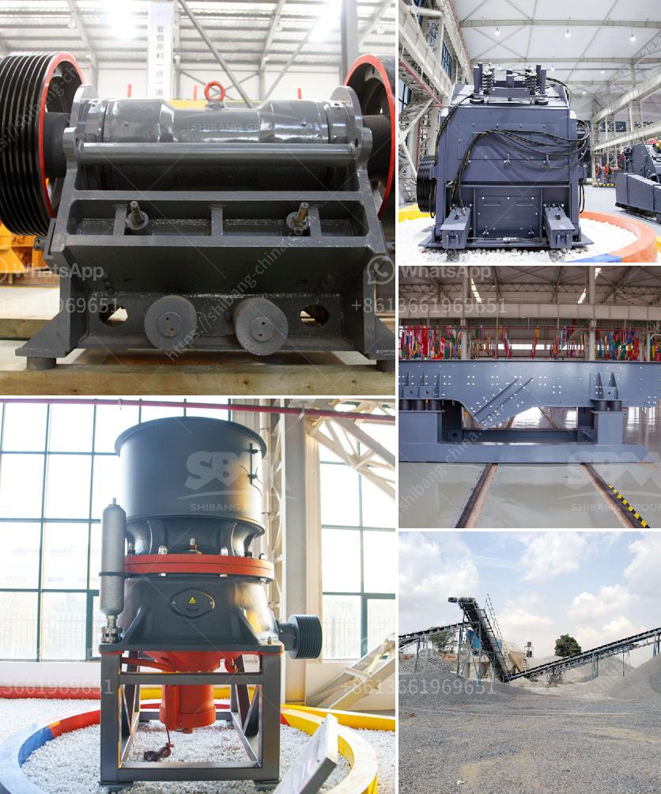

<h3>how to start stone crusher unit in kenya</h3>
Starting a stone crusher unit can be intimidating for many people, especially for those who are new in the industry. It is true that one can’t just jump into it without adequate preparation. However, if you follow certain steps, starting a stone crusher unit can be a smooth process. Here's a guide on how to start a stone crusher unit in Kenya.

Before you can start a stone crusher unit, it is important to research the market, analyze competitors, and understand the demand for crushed stones in your area. This will help you determine whether there is a market for your product and how you can position yourself to attract customers.

Finding the right location for your stone crusher unit is crucial. You need to consider factors such as proximity to raw materials, accessibility, and the distance from potential customers. Additionally, ensure that the location is zoned for stone crushing activities and complies with environmental regulations.

To operate a stone crusher unit legally, you will need to obtain various permits and licenses. These may include a business license, environmental clearance certificate, mining license, and consent to establish from the relevant local authorities. Make sure you gather all the necessary documents and fulfill the requirements before starting the unit.

Once you have secured the necessary permits and licenses, it is time to procure the required equipment and machinery for stone crushing. Your equipment needs to be of good quality and capable of efficiently crushing stones. Consider factors such as crushing capacity, power consumption, and ease of maintenance when selecting the machinery.

Operating a stone crusher unit requires hiring skilled and experienced staff, such as machine operators, mechanics, and administrative personnel. Seek professionals who have prior experience in the stone crushing industry and are familiar with the equipment and machinery you have procured.

To attract customers and establish a strong presence in the market, you need to develop a comprehensive marketing strategy. This can include creating a website, utilizing social media platforms, networking with local construction companies, and participating in trade fairs or exhibitions. A strong marketing strategy will help to create awareness about your stone crusher unit and attract potential customers.

To ensure the smooth operation of your stone crusher unit, it is essential to conduct regular maintenance checks and monitor the performance of the equipment. This will help identify any issues or malfunctions promptly and take corrective action. Proper maintenance and monitoring will also prolong the lifespan of your machinery and minimize downtime.

Starting a stone crusher unit in Kenya may seem challenging, but with proper planning and execution, it can be a profitable venture. Research the market, secure necessary permits and licenses, procure quality equipment, hire qualified staff, and develop an effective marketing strategy. Additionally, regularly maintaining and monitoring your equipment will contribute to the success and longevity of your stone crusher unit.
<h3>Contact us</h3><ul><li><strong>Whatsapp:&nbsp;<a href="https://wa.me/8613661969651">+8613661969651</a></strong></li><li><a href="https://swt.shibang-china.com/?git&amp;zhl&amp;how to start stone crusher unit in kenya"><strong>Online Service(chat now)</strong></a></li></ul><h3>Related</h3><ul><li><a href='selling ball mill thailand.md'>selling ball mill thailand</a></li><li><a href='crusher on rent in india.md'>crusher on rent in india</a></li><li><a href='vibrating screen for 150 microns.md'>vibrating screen for 150 microns</a></li><li><a href='how to wash sand for construction.md'>how to wash sand for construction</a></li><li><a href='used conveyor belt for sale europe.md'>used conveyor belt for sale europe</a></li></ul>