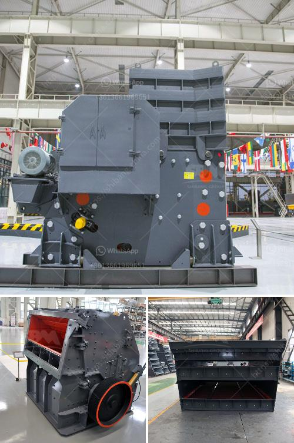

<h3>how to wash sand for construction</h3>
When it comes to any construction project, using clean sand is crucial. Dust, debris, and other impurities found in sand can have a negative impact on the quality and durability of the final product. That's why it is essential to wash the sand thoroughly before using it in any building or infrastructure project. In this article, we will guide you through the process of washing sand for construction.

To wash sand effectively, you will need a few basic tools and materials. These include a large bucket or a wheelbarrow for holding the sand, a hose with a high-pressure nozzle, a shovel or a rake, and a sieve or a screen.

Select a suitable area for washing the sand. Ideally, this should be an open space where the water can drain off easily. Make sure the area is free from any obstructions or plants that may be damaged by the process.

Start by removing any visible debris or large stones from the sand. You can use a shovel or a rake to carefully pick out these impurities. This step will help prevent blockages in further stages of the process and ensure a more efficient washing process.

Place the sand in the bucket or wheelbarrow and rinse it thoroughly using a hose with a high-pressure nozzle. The high-pressure water will help break up clumps and dislodge any remaining impurities. Continue rinsing until the water runs clear.

To further clean the sand and remove finer impurities, use a sieve or a screen. Gently pour the sand onto the sieve and shake it or use your hand to move the sand evenly across the screen. This will help separate any remaining debris or foreign matter from the sand.

After screening, rinse the sand again using the high-pressure hose nozzle. Make sure to thoroughly rinse all the sand to ensure that it is free from any residual impurities.

Once the sand is thoroughly rinsed, drain the excess water from the container. If possible, leave the sand in direct sunlight to dry completely. The sunlight will help eliminate any remaining moisture and kill bacteria or other microorganisms present in the sand.

After the sand is completely dry, you can store it in a clean, dry, and covered area until it is ready for use. Proper storage will keep your sand clean and free from any new impurities.

In conclusion, washing sand for construction is an essential process to achieve high-quality results in any building or infrastructure project. By following these simple steps, you can ensure that your sand is free from impurities, enhancing the strength and longevity of your construction materials. Remember, clean sand is the foundation for a solid and durable structure.
<h3>Contact us</h3><ul><li><strong>Whatsapp:&nbsp;<a href="https://wa.me/8613661969651">+8613661969651</a></strong></li><li><a href="https://swt.shibang-china.com/?git&amp;zhl&amp;how to wash sand for construction"><strong>Online Service(chat now)</strong></a></li></ul><h3>Related</h3><ul><li><a href='shell powder making machine grinding mill for sale.md'>shell powder making machine grinding mill for sale</a></li><li><a href='roller crusher cad detail drawing.md'>roller crusher cad detail drawing</a></li><li><a href='jaw crusher vs gyratory crusher stone crusher quarry.md'>jaw crusher vs gyratory crusher stone crusher quarry</a></li><li><a href='rock pulverizer crusher technologies.md'>rock pulverizer crusher technologies</a></li><li><a href='crushing of gold mining dust.md'>crushing of gold mining dust</a></li></ul>