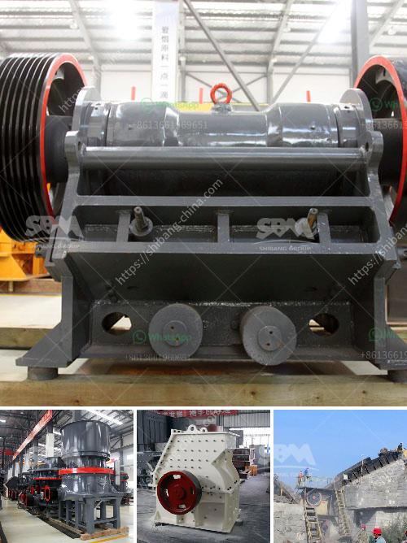

<h3>hp 300 cone crusher</h3>
The HP 300 cone crusher is a versatile machine that offers a wide range of applications for various processing needs. By continuing to innovate and exceed customer expectations, Metso has created a machine that provides class-leading efficiency, productivity, and ease of maintenance.

The HP (High Performance) series cone crusher is the best performing crusher in the market. It allows users to easily crush the toughest materials. This includes granite, basalt, iron ore, and more. The crusher is equipped with a powerful motor that drives the engine and generates high-quality end products.

One of the standout features of the HP 300 cone crusher is its ability to process high volumes of material without any loss of performance. This is due to the combination of the high-speed rotor and the patented crushing chamber design. The crusher's unique design allows for excellent particle shape and consistent gradation, providing superior end products compared to traditional crushers.

In addition to its impressive performance, the HP 300 cone crusher is also highly efficient. The crusher's advanced hydraulic system enables the machine to have better fuel economy, lower emissions, and reduced noise levels. This makes it an ideal choice for environmentally conscious customers.

Maintenance is made easy with the HP 300 cone crusher. The machine is designed to be user-friendly, with a simple interface that allows operators to easily adjust settings and monitor performance. In addition, the crusher's robust construction and durable components ensure a longer lifespan and reduced downtime.

Furthermore, the HP 300 cone crusher is equipped with Metso's IC70C automation system. This advanced system continuously monitors and optimizes the crusher's performance, while ensuring consistent and reliable operation. The IC70C automation system also enables remote monitoring and control, allowing operators to manage the crusher from a safe distance.

With its outstanding performance, efficiency, and ease of maintenance, the HP 300 cone crusher is an excellent choice for any quarry or mining operation. It delivers superior quality end products, while reducing operational costs and maximizing production. The crusher's advanced technology and user-friendly design make it a reliable and efficient solution for crushing needs.

In conclusion, the HP 300 cone crusher is a versatile and efficient machine that exceeds customer expectations. It combines high performance, efficiency, and ease of maintenance to provide superior quality end products. Whether used in a quarry or mining operation, the HP 300 cone crusher offers a wide range of applications and benefits for any crushing needs.
<h3>Contact us</h3><ul><li><strong>Whatsapp:&nbsp;<a href="https://wa.me/8613661969651">+8613661969651</a></strong></li><li><a href="https://swt.shibang-china.com/?git&amp;zhl&amp;hp 300 cone crusher"><strong>Online Service(chat now)</strong></a></li></ul><h3>Related</h3><ul><li><a href='manufacturing equipments of lime stone milling.md'>manufacturing equipments of lime stone milling</a></li><li><a href='mobile crusher for sale in philippines.md'>mobile crusher for sale in philippines</a></li><li><a href='crushing plants in malaysia.md'>crushing plants in malaysia</a></li><li><a href='vertical grinding machine black and dacker.md'>vertical grinding machine black and dacker</a></li><li><a href='adjustement of gradation at crusher plant.md'>adjustement of gradation at crusher plant</a></li></ul>