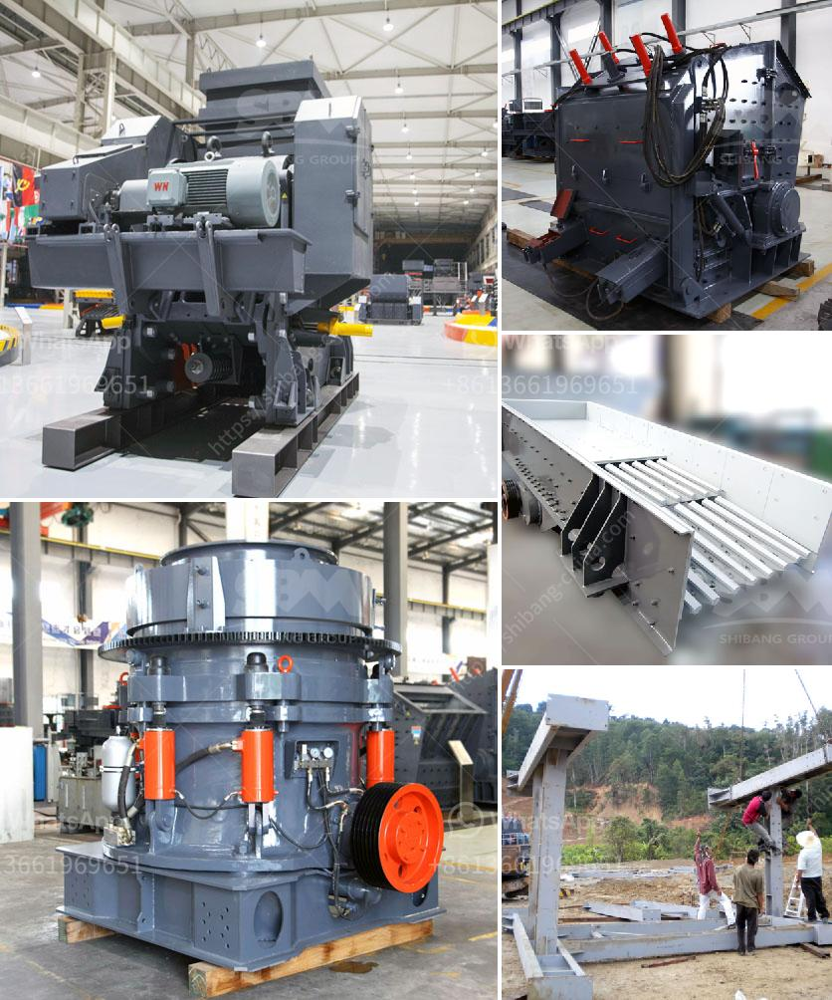

<h3>hydrated lime powder making machine from germany</h3>
In the pursuit of achieving sustainable development goals, countries worldwide are constantly striving to improve their infrastructure and find innovative ways to reduce carbon emissions. Among the various industries, the construction sector plays a crucial role in both economic growth and environmental impact. To meet the growing demands and challenges of the construction industry, Germany has introduced an advanced Hydrated Lime Powder Making Machine that offers a revolutionary solution.

Hydrated lime, also known as calcium hydroxide (Ca(OH)2), is a key ingredient used in various construction applications. It is produced by adding water to quicklime (calcium oxide or CaO), which undergoes a chemical reaction to form a fine white powder. Hydrated lime has proven to be an essential compound, widely used in construction, agriculture, chemical manufacturing, and environmental applications.

The traditional process of producing hydrated lime involves burning limestone in a kiln, known as quicklime production. This process is associated with high energy consumption and carbon dioxide emissions. To mitigate these environmental concerns, Germany has developed a cutting-edge Hydrated Lime Powder Making Machine that offers greener and more efficient lime production.

The advanced technology utilized in the German machine enables a more sustainable and economical process. Firstly, the machine utilizes a vertical air classifier system that enables the production of high-quality hydrated lime powder with controlled particle size distribution. This ensures that the powder meets industry standards and specific project requirements, providing consistency in performance.

Moreover, the German machine incorporates a highly efficient heat exchanger system, which significantly reduces energy consumption during the production process. The heat exchanger enables the recovery and reutilization of heat generated during the calcination process. This not only minimizes energy waste but also results in substantial cost savings for the lime manufacturers.

Furthermore, the Hydrated Lime Powder Making Machine employs advanced dust collection technology, ensuring the containment and filtration of fine particles. This reduces harmful emissions and improves the air quality within the production facility, promoting a safer working environment for the operators.

Additionally, the German machine offers enhanced automation and control features, enabling operators to monitor and control the production process efficiently. This contributes to improved productivity and reduces human error, ensuring consistent quality and reliability of the hydrated lime powder produced.

Germany's commitment to sustainable development extends beyond its borders. The Hydrated Lime Powder Making Machine is not only set to revolutionize lime production within the country but also offers an opportunity for international collaboration. The advanced technology can be shared and replicated in other countries, enabling them to reduce their carbon footprint and adopt more environmentally friendly practices in lime production.

In conclusion, Germany's Hydrated Lime Powder Making Machine is a groundbreaking solution that addresses the environmental concerns associated with traditional lime production. It offers an efficient, cost-effective, and sustainable alternative that meets the demands of the construction industry while minimizing carbon emissions. By embracing this innovative technology, countries can enhance their infrastructure development efforts and contribute to a greener and more sustainable future.
<h3>Contact us</h3><ul><li><strong>Whatsapp:&nbsp;<a href="https://wa.me/8613661969651">+8613661969651</a></strong></li><li><a href="https://swt.shibang-china.com/?git&amp;zhl&amp;hydrated lime powder making machine from germany"><strong>Online Service(chat now)</strong></a></li></ul><h3>Related</h3><ul><li><a href='cost of barite crusher in nigeria.md'>cost of barite crusher in nigeria</a></li><li><a href='sag mill grinding ball.md'>sag mill grinding ball</a></li><li><a href='jaw crusher machine for sale.md'>jaw crusher machine for sale</a></li><li><a href='crusher machine for sale in ethiopia.md'>crusher machine for sale in ethiopia</a></li><li><a href='basalt crushing production line.md'>basalt crushing production line</a></li></ul>