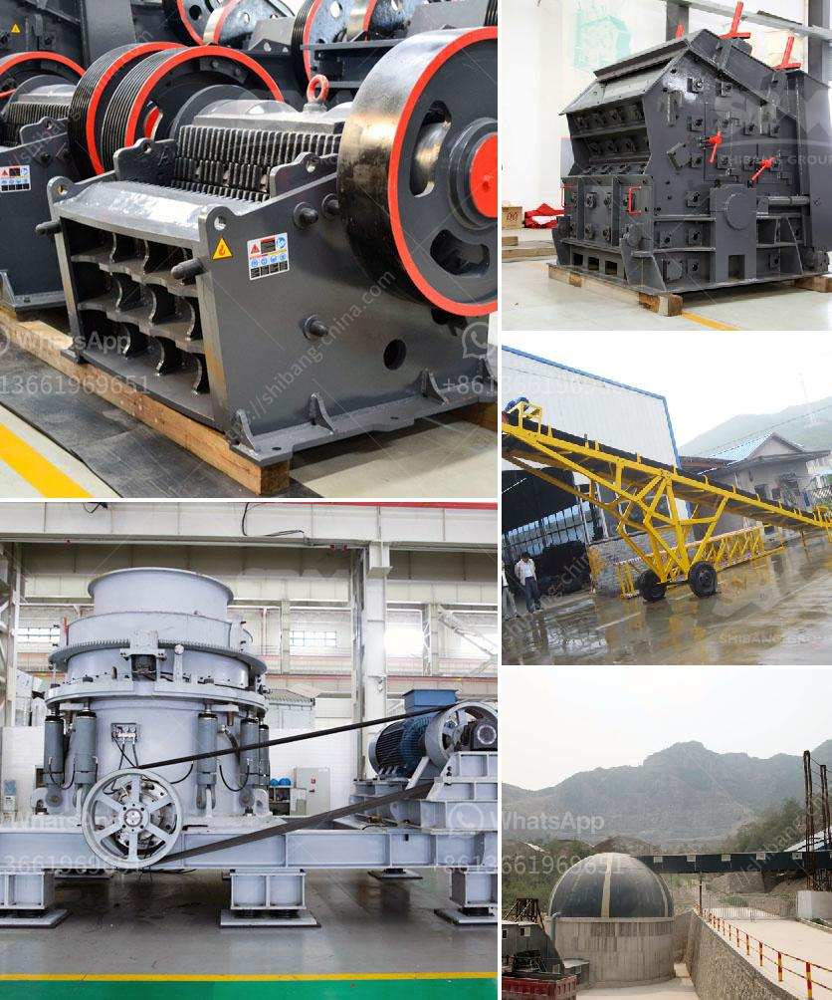

<h3>hydraulic cone crusher price</h3>
The hydraulic cone crusher is widely used in mining, building materials, transportation, energy, chemical and other industries. It is suitable for various ores and rocks with medium and medium above hardness, such as quartz stone, river pebble, calcite, dolomite, granite, basalt.

Iron ore, limestone, diabase, etc. The production capacity is 36-650 tons/hour. Compared with the traditional cone crusher, the hydraulic cone crusher has a higher output, lower grain size, and generates less dust. It can produce finished products with better shape and uniform grain size.

When purchasing equipment, users always consider the price of the machine. While users are concerned about the price, they should also consider the cost performance of the machine. Many users always go to the inferior price equipment, so the actual production will be too high.

If the quality of the equipment purchased is not good, and the service life is short, the cost of subsequent maintenance may increase. The key factor affecting the price of hydraulic cone crusher is the model. Each model of equipment has different specifications and different performances.

Its price will be higher or lower. In addition, there are also many factors affecting the price of hydraulic cone crushers, such as manufacturers, equipment quality, technical level, and market demand. Different manufacturers have different production costs and different prices.

The quality and technical level of the equipment produced by different manufacturers are different. The equipment produced by manufacturers with advanced technology and high-quality materials will be more expensive. Factors such as market supply and demand and the popularity of manufacturers will also affect the price.

In general, the hydraulic cone crusher produced by the manufacturer is higher than the gravel cone crusher price according to its specific situation. The price of the equipment will vary due to the different needs of customers.

For the quotation of the hydraulic cone crusher, it is also determined according to the specific configuration of the customer. The specific configuration includes the selection of the feeder, the jaw crusher and the screen. The quality and price of these equipment affect the final price of the crusher.

The generall crushing process uses jaw crusher as the primary crusher, and then sent to the tertiary equipment hydraulic cone crusher for fine crushing. After crushing, it is sieved by a circular vibrating screen, and the qualified material is sent to the sand making machine for sand making.

According to the different configurations, the price can be adjusted according to the specific situation of the user. Of course, the price of the hydraulic cone crusher will be different according to the specific needs of the user. Different configurations require different equipment and different production processes.

Therefore, the price will be different. If the user has a large demand for production, so large-scale and large-capacity hydraulic cone crushers are needed. The price of these crushers is high. However, the output of such crushers is as high as 450 tons per hour, which satisfies most users.

The price quotient can reflect the price value of equipment in a certain period of time. For example, the price of hydraulic cone crusher in Shibang is 20-50% higher than that of traditional cone crusher because of its advanced technology and better equipment quality.

In summary, the price of hydraulic cone crusher is influenced by many factors, such as equipment quality, market supply and demand, manufacturer's strength, and user's needs. Only by choosing equipment with reasonable prices and excellent performance can users achieve higher returns.
<h3>Contact us</h3><ul><li><strong>Whatsapp:&nbsp;<a href="https://wa.me/8613661969651">+8613661969651</a></strong></li><li><a href="https://swt.shibang-china.com/?git&amp;zhl&amp;hydraulic cone crusher price"><strong>Online Service(chat now)</strong></a></li></ul><h3>Related</h3><ul><li><a href='calcite processing machine.md'>calcite processing machine</a></li><li><a href='crushing  screening plant.md'>crushing & screening plant</a></li><li><a href='mobile crushing plant hire product.md'>mobile crushing plant hire product</a></li><li><a href='limestone processing flow sheet.md'>limestone processing flow sheet</a></li><li><a href='ball grinding mill buy.md'>ball grinding mill buy</a></li></ul>