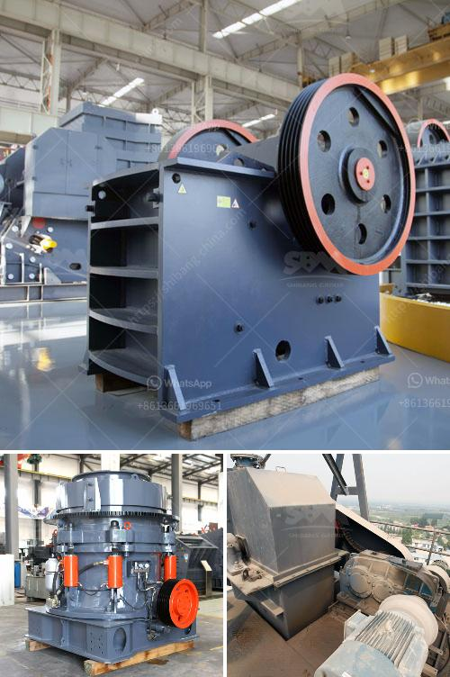

<h3>hydraulic system loesche mill</h3>
The hydraulic system is a crucial component in the operation of the Loesche mill. It allows for smooth and efficient grinding of raw material, coal, and cement clinker. With advanced hydraulic control, a mill is capable of producing a variety of products, such as high-quality cement or even blended cements. The hydraulic system itself can accomplish the operation of a mill with less power consumption, noise, and wear.

One of the key features of the Loesche mill's hydraulic system is its ability to maintain a consistent grinding pressure. This means that the mill can be set to operate with the desired output and quality, regardless of fluctuations in the raw material properties. The hydraulic system also allows for quick and precise control of the grinding process, enabling the mill to adapt to changing materials or product requirements.

The Loesche mill's hydraulic system is designed with a range of safety features. These include a pressure relief valve, which prevents excessive pressure buildup in the system, and a temperature control system that ensures optimal operating conditions are maintained. Additionally, the hydraulic system is constructed to minimize the risk of leakage or contamination, enhancing the mill's reliability and longevity.

Furthermore, the hydraulic system in a Loesche mill is also responsible for the lift and swing of the grinding rollers. This feature enables the mill to efficiently grind and convey the crushed material to the separator, resulting in a more homogeneous product. The ability to lift and swing the grinding rollers also facilitates maintenance operations, as it provides easy access to the grinding elements for inspection, repair, or replacement.

Overall, the hydraulic system of a Loesche mill plays a crucial role in its efficient and reliable operation. Through precise control of grinding pressure, quick response to material or product changes, and enhanced safety features, the hydraulic system contributes to achieving optimal mill performance. With its ability to produce a wide range of products with consistent quality, the Loesche mill remains a leading choice for the grinding of raw materials, coal, and cement clinker.
<h3>Contact us</h3><ul><li><strong>Whatsapp:&nbsp;<a href="https://wa.me/8613661969651">+8613661969651</a></strong></li><li><a href="https://swt.shibang-china.com/?git&amp;zhl&amp;hydraulic system loesche mill"><strong>Online Service(chat now)</strong></a></li></ul><h3>Related</h3><ul><li><a href='river stone crushing equipment.md'>river stone crushing equipment</a></li><li><a href='favrica of ball mills.md'>favrica of ball mills</a></li><li><a href='silica sand beneficiation plant for glass.md'>silica sand beneficiation plant for glass</a></li><li><a href='raymond mill and high pressure difference.md'>raymond mill and high pressure difference</a></li><li><a href='stone crusher and quarry plant in galway ireland.md'>stone crusher and quarry plant in galway ireland</a></li></ul>